# PEA-i: Especificación integral, arquitectura, dominio y cumplimiento del Taller 2

> **Programa Estadístico de Análisis de Investigación**  
> Universidad Popular del Cesar  
> Asignatura: Estructura de Datos  
> Documento maestro de análisis, diseño y trazabilidad  
> Versión 2.1 - 25 de septiembre de 2026

---

## Estado del documento

Este archivo sustituye la versión anterior y consolida en un solo lugar:

- El contexto funcional de PEA-i.
- La arquitectura React, FastAPI, Python, pybind11, C++ y SQL Server.
- El dominio, las entidades y el modelo relacional.
- Las reglas de negocio.
- Las estructuras de datos obligatorias.
- Las variables de entrada y salida.
- La aproximación de hipercubo.
- Las dos soluciones ejecutables exigidas, una en C++ y otra en Python.
- La aplicación web integrada.
- La persistencia en SQL Server y en archivo JSON.
- Los entregables académicos y administrativos.
- La matriz de cumplimiento requisito por requisito.
- Las decisiones de alcance del equipo y su justificación (sección 26.1).
- Las pruebas y evidencias necesarias para afirmar cumplimiento total.

> **Nota de alcance:** este documento distingue entre diseño, implementación y evidencia. Que una función esté diseñada no significa que ya esté implementada o probada.

---

## Tabla de contenido general

1. Contexto, dominio y especificación funcional
2. Correcciones de cobertura del Taller 2
3. Matriz de cumplimiento completa
4. Hipercubo de información
5. Variables de entrada y salida
6. CRUD y persistencia por estructura
7. Dos soluciones ejecutables e integración
8. Persistencia dual e inicialización
9. Dashboard estadístico integrado y resumen C++
10. Entregables obligatorios
11. Diagramas y documentación pendientes
12. Matriz de trazabilidad y pruebas
13. Alcance obligatorio y complementario
14. Estructura final del repositorio
15. Lista de comprobación de entrega

---

# PARTE I. ESPECIFICACIÓN FUNCIONAL Y TÉCNICA CONSOLIDADA

## 1. Contexto, dominio y especificación funcional

### 1.1 Contexto institucional y motivación
La Universidad Popular del Cesar (UPC), a través de sus grupos e institutos de investigación adscritos a las diferentes facultades (Ingenierías y Tecnologías, Ciencias de la Salud, Ciencias Básicas y de la Educación, Ciencias Administrativas, Contables y Económicas, y Derecho y Ciencias Políticas), participa activamente en el Sistema Nacional de Ciencia, Tecnología e Innovación (SNCTeI) de Colombia, coordinado por el Ministerio de Ciencia, Tecnología e Innovación (Minciencias).

En este marco, la categorización institucional y la asignación de recursos dependen críticamente del reconocimiento y medición de grupos de investigación e investigadores bajo los términos de referencia vigentes (Convocatoria 957 de 2024). Históricamente, las instituciones de educación superior enfrentan serias dificultades:
- **Dispersión de la información:** Los datos de producción académica residen en plataformas heterogéneas (plataforma Scienti: aplicativos GrupLAC para grupos y CvLAC para hojas de vida de investigadores, portales de revistas indexadas, repositorios de patentes y sistemas de datos abiertos institucionales).
- **Inconsistencia y duplicidad:** Un mismo artículo, libro o desarrollo de software suele ser reportado simultáneamente por múltiples coautores vinculados a distintos grupos o departamentos, distorsionando las estadísticas si no existe conciliación determinista de duplicados.
- **Falta de trazabilidad y auditoría:** Se carece de un flujo de validación técnica formal que permita certificar si una evidencia cumple los periodos de observación (ventanas de 2 o 5 años) o las exigencias documentales antes del cierre de convocatorias.
- **Rendimiento computacional:** La gestión de miles de registros bibliográficos y relaciones cruzadas mediante bases de datos puramente relacionales genera sobrecargas innecesarias cuando se requieren cálculos interactivos en tiempo real.

Para responder a estos desafíos se concibió **PEA-i (Programa Estadístico de Análisis de Investigación)**, desarrollado como proyecto integrador del Taller 2 de la asignatura *Estructura de Datos* en la Universidad Popular del Cesar.

### 1.2 Objeto del sistema
PEA-i es una solución híbrida de alto rendimiento diseñada para:
1. **Modelar y gestionar en memoria principal (RAM)** las entidades fundamentales de investigación mediante estructuras de datos dinámicas construidas manualmente con punteros en C++ (sin librerías STL de alto nivel ni contenedores prefabricados).
2. **Proveer interoperabilidad bidireccional nativa** entre el núcleo algorítmico en C++ y un ecosistema moderno en Python mediante enlaces pybind11 compilados.
3. **Ofrecer una interfaz web moderna, responsiva y accesible** construida en React, TypeScript y TailwindCSS, con doble interfaz: portal público institucional y panel administrativo avanzado.
4. **Garantizar la persistencia integral** a través de dos canales: base de datos relacional SQL Server (con sincronización write-through inmediata y transacciones ACID) y archivos JSON normalizados (`pea_data.json`) para transporte y evaluación académica independiente.
5. **Automatizar la ingesta y conciliación** de información pública desde Scienti (GrupLAC y CvLAC) con cálculo de huellas digitales estables y deduplicación por DOI y firmas de autor.
6. **Implementar un flujo de validación técnica y control de cambios** con orden estricto FIFO para revisión de evidencias y pila LIFO para reversión de operaciones (deshacer).

---

## 2. Correcciones de cobertura del Taller 2

Para garantizar que el sistema satisfaga los requisitos del Taller 2 sin incurrir en contradicciones entre la especificación y la base de código real, se establecen las siguientes directrices y aclaraciones canónicas:

1. **Unificación de la persistencia de productos:** Todo producto gestionado almacena los 20 atributos canónicos requeridos por el modelo Minciencias 2024 (código externo, título, descripción, familia, subtipo, categoría de calidad, fecha de obtención, fecha de publicación, año, idioma, país, DOI, ISBN, ISSN, URL, evidencia documental, atributos especializados, estado de validación y estado del registro).
2. **Autores de productos como entidad formal:** Conforme a la sección 30 y 33.2, la relación entre productos e investigadores se implementa mediante la multilista `ProductAuthorNode` en C++, sincronizada tanto con la tabla SQL Server `ProductAuthor` como con la colección `"authors"` del archivo JSON de persistencia.
3. **Reglas de vinculación temporal (RV-001 y RV-002):** La gestión de integrantes en grupos valida estrictamente la no inversión de periodos (RV-001) y la no superposición de vinculaciones vigentes, admitiendo el reingreso no solapado (RV-002), respondiendo con códigos HTTP 400 y mensajes de negocio explícitos ante infracciones.
4. **Catálogo canónico 2024:** El catálogo oficial siembra 5 familias de producción y 70 subtipos normalizados (10 en Generación de Nuevo Conocimiento, 26 en Desarrollo Tecnológico e Innovación, 4 en Apropiación Social del Conocimiento, 21 en Divulgación Pública de la Ciencia y 9 en Formación de Recurso Humano), superando el estimado previo de 56 subtipos.
5. **Alineación con la decisión D-03:** La ingesta oficial se ejecuta por URL directa desde la plataforma Scienti (GrupLAC y CvLAC) y mediante importación del archivo `pea_data.json`. Las rutas de archivos planos antiguos (CSV/PDF) quedan formalmente excluidas por obsolescencia frente a la fuente web viva.

---

## 3. Matriz de cumplimiento completa

A continuación se sintetiza el estado de cobertura de cada requerimiento del Taller 2:

| Requisito | Descripción Taller | Implementación en Core C++ | Implementación en Python / React | Estado |
|---|---|---|---|:---:|
| **T-01** | Solución en C/C++ | Core estático `abpoxx.lib` y CLI `pea_cli.exe` | N/A (nativo autónomo) | **Cumplido** |
| **T-02** | Solución en Python | Integrado vía `abpoxx_pybind` | Backend FastAPI (`backend/app`) | **Cumplido** |
| **T-03** | Estructuras en RAM | Nodos manuales con punteros directos | Lectura y manipulación transparente | **Cumplido** |
| **T-04** | Lista de Grupos | `GroupNode` (lista simplemente enlazada) | Endpoints `/api/v1/groups` | **Cumplido** |
| **T-05** | Lista de Investigadores | `ResearcherNode` (lista enlazada simple) | Endpoints `/api/v1/researchers` | **Cumplido** |
| **T-06** | Multilista de Integrantes | `MembershipNode` (doble cadena grupo/investigador) | Pestaña "Integrantes" + `/memberships` | **Cumplido** |
| **T-07** | Membresías con rol y fechas | `Membership` con `role`, `start_date`, `end_date` | Modales de vinculación y edición con fechas | **Cumplido** |
| **T-08** | Planes de trabajo | `PlanNode` (cadena anclada a `GroupNode`) | Endpoints `/plans` + UI "Planes" | **Cumplido** |
| **T-09** | Proyectos autónomos | `ProjectNode` (lista global) + `GroupProjectNode` | Endpoints `/projects` + UI "Proyectos" | **Cumplido** |
| **T-10** | Multilista de Productos | `GroupProductNode` (doble cadena grupo/producto) | Endpoints `/groups/{id}/products` | **Cumplido** |
| **T-11** | Ingesta desde URL Scienti | Consumo write-through desde backend | Scrapers GrupLAC y CvLAC con dedupe | **Cumplido** |
| **T-12 / 13** | Ingesta PDF / CSV | Descartada por Decisión D-03 | Sustituida por URL Scienti y `pea_data.json` | **Excluido (D-03)** |
| **T-14** | Cola FIFO de validación | `ValidationQueueItem` / `ValidationQueue` | Panel `/admin/validation-queue` | **Cumplido** |
| **T-15** | Pila LIFO de deshacer | `UndoOperation` / `UndoStack` | Historial interactivo `/admin/undo` | **Cumplido** |
| **T-16** | Ventana de observación | Filtrado dinámico por fechas y `window_years` | Parámetros query + selector en reportes PDF | **Cumplido** |
| **T-17** | Persistencia SQL Server | ODBC nativo (`db_persistence.cpp`) | Inicialización automática y sincronización | **Cumplido** |
| **T-18** | Persistencia JSON | Serialización manual (`json_persistence.cpp`) | `/system/export` y `/system/initialize/file` | **Cumplido** |
| **T-19** | Dashboard estadístico | Agregados en C++ (`db_persistence.cpp`) | KPIs en `/admin` y gráficos Recharts en `/portal` | **Cumplido** |
| **T-20** | Resumen en consola | `pea_cli summary` / `print_summary()` | Tablas formateadas ASCII con métricas | **Cumplido** |

---

## 4. Hipercubo de información

### 4.1 Definición conceptual y matemática
El hipercubo de información de PEA-i es un modelo multidimensional orientado al análisis analítico en línea (OLAP) de la producción científica institucional. Permite desagregar, filtrar y consolidar los indicadores de ciencia y tecnología a través de un espacio de cuatro dimensiones ortogonales:

$$\mathcal{H} = D_{\text{Entidad}} \times D_{\text{Tiempo}} \times D_{\text{Tipología}} \times D_{\text{Validación}} \longrightarrow \mathcal{M}$$

Donde cada celda del hipercubo proyecta un vector de medidas escalares $\mathcal{M} = \langle V_p, W_i, R_a \rangle$:
- $V_p$: Volumen total de productos (conteo cardinal de ítems únicos deduplicados).
- $W_i$: Peso institucional ponderado según los factores de calidad de la convocatoria Minciencias 2024.
- $R_a$: Tasa de aprobación o efectividad en validación técnica ($V_p^{\text{valid}} / V_p^{\text{total}}$).

```
                      +---------------------------------------+
                     /           ESTADO DE VALIDACIÓN        /|
                    /   [Pendiente | Válido | Rechazado]    / |
                   +---------------------------------------+  |
                   |                                       |  |
                   |                                       |  |  TIPOLOGÍA
   ENTIDAD         |           CELDA ANALÍTICA             |  |  MINCIENCIAS
   ORGANIZACIONAL  |       { Volumen, Ponderación,         |  |  (GNC, DTI, ASC,
   (Grupos,        |         Tasa de Validación }          |  +  DPC, FRH - 70 subtipos)
   Investigadores) |                                       | /
                   |                                       |/
                   +---------------------------------------+
                                  TIEMPO
                     (Años calendario / Ventana 2 y 5 años)
```

### 4.2 Dimensiones del hipercubo
1. **Dimensión Entidad ($D_{\text{Entidad}}$):**
   - Jerarquía: `Institución (UPC) → Facultad → Departamento → Grupo de Investigación → Investigador`.
   - Permite consultar la producción total de la universidad o aislar el aporte de un investigador particular en sus diferentes vinculaciones.
2. **Dimensión Tiempo ($D_{\text{Tiempo}}$):**
   - Jerarquía: `Trienio de Medición → Año Calendario → Mes / Fecha de Obtención`.
   - Implementa ventanas deslizantes canónicas de 2 años (productos de ciclo corto), 5 años (productos de ciclo estándar) o periodos personalizados definidos por el usuario gestor.
3. **Dimensión Tipología ($D_{\text{Tipología}}$):**
   - Jerarquía: `Familia (5) → Subtipo Minciencias (70) → Categoría de Calidad (A1, A, B, C / Top, A, B)`.
   - Permite clasificar desde grandes áreas (p. ej., Desarrollo Tecnológico) hasta la granularidad de software con registro de soporte lógico o variedades vegetales protegidas.
4. **Dimensión Validación ($D_{\text{Validación}}$):**
   - Estados: `Pendiente de Validación`, `Válido / Certificado`, `Rechazado con Observación Técnica`.
   - Facilita auditar la madurez del banco de evidencias antes de la radicación final de la convocatoria.

### 4.3 Operaciones OLAP soportadas
- **Roll-Up:** Agregación hacia arriba; por ejemplo, sumar los productos de los grupos de un departamento para calcular el indicador de facultad.
- **Drill-Down:** Desagregación detallada; pasar del conteo general de artículos de un grupo a la lista discriminada por categoría de calidad cuartílica (Q1 a Q4).
- **Slice (Corte):** Fijar una dimensión específica; por ejemplo, seleccionar únicamente los productos con estado `valid` en la ventana 2024–2026.
- **Dice (Segmentación):** Restringir un subcubo mediante múltiples condiciones; por ejemplo, productos de la familia GNC, en el Grupo AITICE, obtenidos entre 2022 y 2025 que cuenten con DOI certificado.
- **Pivot (Pivote):** Rotar los ejes en la interfaz web para visualizar las familias Minciencias como filas y los años de obtención como columnas.

---

## 5. Variables de entrada y salida

### 5.1 Variables de entrada
Las variables que alimentan el sistema provienen de interacciones de usuario en la interfaz web, comandos en la CLI y respuestas HTTP de servicios externos:

| Módulo | Variable | Tipo | Restricción / Formato | Propósito |
|---|---|---|---|---|
| **Grupos** | `name` | String | Requerido, 3-255 caracteres | Nombre oficial del grupo |
| | `external_code` | String | Único, alfanumérico (ej. `COL0027788`) | Código de identificación institucional o Scienti |
| | `acronym` | String | Opcional, hasta 50 caracteres | Sigla identificadora |
| | `classification` | String | `A1`, `A`, `B`, `C`, `Reconocido` | Categoría oficial Minciencias |
| **Investigadores**| `first_names`, `last_names` | String | Requeridos | Nombres y apellidos |
| | `identification_number`| String | Alfanumérico | Documento de identidad |
| | `institutional_email` | String | Formato email `@unicesar.edu.co` | Contacto institucional |
| | `orcid` | String | `0000-0000-0000-0000` | Identificador internacional de autor |
| **Membresías** | `role` | String | Líder, Investigador, Estudiante | Rol desempeñado en el grupo |
| | `start_date`, `end_date`| String | `YYYY`, `YYYY-MM` o `YYYY-MM-DD` | Periodo de vinculación (sujeto a RV-001/002) |
| **Productos** | `title` | String | Requerido, hasta 1000 caracteres | Título de la obra o producto |
| | `family_id`, `subtype_id`| Entero | Llaves foráneas válidas del catálogo | Clasificación tipológica Minciencias |
| | `year` / `obtained_date`| Entero / String | $1900 \le \text{año} \le 2100$ | Año o fecha de obtención |
| | `doi`, `isbn`, `issn` | String | Formatos estándar internacionales | Identificadores de publicación |
| **Validación** | `status` | String | `valid`, `rejected`, `pending` | Dictamen del evaluador técnico |
| | `reason` | String | Requerido si el estado es `rejected` | Justificación técnica del rechazo |
| **Ventana** | `start_year`, `end_year`| Entero | $start \le end$ | Rango de observación estadística |

### 5.2 Variables de salida
El sistema produce salidas estructuradas en múltiples formatos:
1. **JSON REST (API):** Colecciones normalizadas de entidades con metadatos de paginación (`total`, `page`, `page_size`, `items`).
2. **Tablas ASCII en Consola (CLI):** Salida por terminal con alineación tabular, recuentos de nodos e indicadores de memoria para auditoría inmediata.
3. **Resúmenes Estadísticos (Dashboard):** Objetos de agregación con totales de productos por año, distribución de estados de validación y porcentajes de cumplimiento tipológico.
4. **Informes PDF Institucionales:** Documentos descargables maquetados con membrete oficial de la UPC, que incluyen datos del grupo, líneas declaradas, integrantes vigentes e históricos, y catálogo de productos filtrados por ventana de observación.
5. **Archivo Serializado `pea_data.json`:** Estructura completa del sistema exportable para backup o evaluación académica.

---

## 6. CRUD y persistencia por estructura

El núcleo C++ modela las operaciones de creación, lectura, actualización y eliminación de forma individual sobre cada estructura enlazada en RAM:

```
[Entrada HTTP / CLI]
        |
        v
+-------------------------------------------------------------------------+
|                              MEMORIA RAM (C++)                          |
|                                                                         |
|  [Lista Grupos] <===========> [Multilista Membresías] <====> [Investig.] |
|        |                               |                         |      |
|        v                               v                         v      |
|  [Planes Trabajo]             [ProductAuthorNode]           [Proyectos] |
|        |                               |                                |
|        +-------------------> [Multilista Productos]                     |
|                                        |                                |
|                  +---------------------+--------------------+           |
|                  |                                          |           |
|                  v                                          v           |
|         [Cola FIFO Validación]                     [Pila LIFO Deshacer] |
+-------------------------------------------------------------------------+
        |                                             ^
        | Write-Through sincrónico                    | Reversión
        v                                             |
+-------------------------------------------------------------------------+
|                            PERSISTENCIA FÍSICA                          |
|                                                                         |
|       SQL Server (16 tablas)           pea_data.json (12 colecciones)   |
+-------------------------------------------------------------------------+
```

### 6.1 Lista simple de Grupos (`GroupNode`)
- **Inserción:** Creación de nodo dinámico en memoria libre (`new GroupNode`). Inserción al final de la lista con tiempo constante amortizado o lineal si se busca unicidad de `external_code`.
- **Búsqueda / Lectura:** Recorrido lineal puntero a puntero (`nextGroup`) por identificador numérico o por código externo.
- **Modificación:** Actualización en el lugar de atributos escalares sin modificar punteros de enlace.
- **Eliminación y Cascada:** Desconexión del nodo en la lista principal y liberación recursiva de todas las cadenas dependientes (desenlace de membresías, desenlace de productos, eliminación de planes de trabajo y enlaces a proyectos).
- **Persistencia:** Write-through inmediato mediante `MERGE` en la tabla `ResearchGroup`.

### 6.2 Lista simple de Investigadores (`ResearcherNode`)
- **Inserción y Mantenimiento:** Inserción enlazada conservando `id` y `external_code`.
- **Eliminación y Cascada:** Al eliminar un investigador se purgan sus referencias en la multilista de membresías y en la multilista de autores de productos.
- **Persistencia:** Replicación sincrónica vía `MERGE` en la tabla `Researcher`.

### 6.3 Multilista de Membresías (`MembershipNode`)
- **Estructura ortogonal:** Cada nodo contiene doble puntero: `nextInGroup` (recorrido de los integrantes de un grupo determinado) y `nextForResearcher` (recorrido de los grupos a los que pertenece un investigador).
- **CRUD:**
  - `add_member_to_group`: Valida RV-001 y RV-002, enlaza en ambas cadenas e inserta en la tabla relacional `GroupMembership`.
  - `update_membership`: Permite actualizar rol o fechas sin romper la continuidad del enlace.
  - `remove_member_from_group`: Desenlaza el nodo de ambas listas y ejecuta la eliminación en BD.

### 6.4 Multilista de Productos y Enlaces (`GroupProductNode`)
- **Estructura cruzada:** Conecta grupos con productos mediante punteros `nextInGroup` y `nextForProduct`. Permite que un producto pertenezca a múltiples grupos si fue desarrollado en coautoría interinstitucional.

### 6.5 Multilista de Autores de Producto (`ProductAuthorNode`)
- **Estructura bidireccional:** Conecta cada producto con sus autores investigadores internos (`nextForResearcher`) y registra autores externos con su nombre e identificador, preservando el orden de autoría (`authorOrder`).

### 6.6 Multilistas de Planes y Proyectos (`PlanNode` y `GroupProjectNode`)
- **Planes de Trabajo:** Cadena simple anclada al nodo de grupo (`firstPlan → nextPlan`).
- **Proyectos:** Lista global de proyectos independientes (`ProjectNode`) interconectada con los grupos mediante nodos de enlace `GroupProjectNode`.

### 6.7 Pila LIFO de Deshacer (`UndoStack`)
- **Operaciones soportadas:** `CREATE`, `UPDATE`, `DELETE`, `LINK_MEMBER`, `UNLINK_MEMBER`, `LINK_PRODUCT`, `UNLINK_PRODUCT`, `LINK_PROJECT`, `UNLINK_PROJECT`, `VALIDATE`.
- **Mecanismo:** Cada modificación apila un registro con el estado previo (`previous_state` serializado). Al ejecutar `undo_perform()`, se desapila la cima, se aplica la acción simétrica inversa en RAM y se sincroniza la base de datos física.

### 6.8 Cola FIFO de Validación (`ValidationQueue`)
- **Operaciones:** Inserción al final (`vq_enqueue`), inspección del frente (`vq_front`) y procesamiento en cabeza (`vq_dequeue` / `vq_process_next`), garantizando estricta equidad cronológica en la revisión de evidencias de investigación.

---

## 7. Dos soluciones ejecutables e integración

Conforme a la decisión de alcance **D-01**, el proyecto entrega las dos soluciones requeridas por el Taller 2 en un esquema de arquitectura limpia e integrada:

### 7.1 Solución A: Núcleo y CLI en C++ (`core_cpp`)
- **Tecnología:** C++20 estándar, compilado con MSVC / GCC / Clang bajo CMake.
- **Componentes:**
  - Librería estática `abpoxx.lib`: Implementa todas las estructuras de datos manuales (`struct GroupNode`, `struct MembershipNode`, etc.), servicios y persistencia ODBC.
  - Ejecutable CLI `pea_cli.exe`: Herramienta de línea de comandos para administración completa sin dependencias externas.
  - Suite de pruebas nativas `pea_tests.exe`: 159 aserciones automáticas que validan cada puntero y operación de memoria.
- **Comandos CLI soportados:**
  - `groups [list|show|add|update|delete]`
  - `researchers [list|show|add|update|delete]`
  - `members [add|list|remove]`
  - `products [all|add|update|delete|list|link|unlink|by-year]`
  - `plans [list|add|update|delete]`
  - `projects [all|add|update|delete]`
  - `queue [list|enqueue|process]`
  - `history [list|top|undo|clear]`
  - `structures [groups|researchers|products|multilist|authors]`
  - `summary`
  - `load <path>` / `export <path>`

### 7.2 Solución B: Backend y Servicios en Python (`backend`)
- **Tecnología:** Python 3.12, framework FastAPI, Uvicorn, Pydantic v2.
- **Componentes:**
  - Módulo `app/repository.py`: Orquestador de la solución. No implementa estructuras en memoria duplicadas; interactúa directamente con el núcleo C++ a través de los bindings compilados.
  - Módulo `app/api/v1.py`: Expone 71 rutas REST organizadas por recursos (`Groups`, `Researchers`, `Products`, `Projects`, `Plans`, `System`, `Reports`).
  - Módulos de scraping y deduplicación (`scraper.py`, `cvlac_scraper.py`): Ingesta directa desde Scienti con conciliación automática de autores y productos.

### 7.3 Puente de Interoperabilidad Nativa (`pybind11`)
- La carpeta `core_cpp/pybind/bindings.cpp` define las envolturas nativas que exponen structs (`Group`, `Researcher`, `Product`, `ProductAuthor`, `Membership`, `Project`, `WorkPlan`, `ValidationQueueItem`, `UndoOperation`) y funciones de gestión al entorno Python bajo el módulo binario `abpoxx_pybind`.
- Se transfieren tipos básicos de C++ a Python por valor y referencias controladas, permitiendo que un cambio ejecutado desde una solicitud HTTP de FastAPI modifique instantáneamente la multilista de nodos en C++.

---

## 8. Persistencia dual e inicialización

El sistema provee dos mecanismos de persistencia complementarios que aseguran la máxima resiliencia:

### 8.1 Motor Relacional SQL Server
- **Esquema de 16 tablas:** Define llaves primarias autoincrementales, restricciones de unicidad sobre códigos externos (`UQ_ResearchGroup_ExternalCode`, `UQ_Product_ExternalCode`), llaves foráneas con integridad referencial e índices especializados.
- **Operaciones Write-Through:** Toda mutación aprobada en memoria RAM dispara inmediatamente una instrucción SQL mediante ODBC nativo (`SQLExecDirect` con sentencias `MERGE`), garantizando que la base de datos física permanezca en exacta sincronía con la memoria.
- **Transaccionalidad en Validaciones:** La validación de un producto actualiza atómicamente la tabla `Product`, el enlace `GroupProductLink`, el registro en `ValidationQueueItem` e inserta una traza inmutable en `AuditLog`.

### 8.2 Archivo de persistencia serializado (`pea_data.json`)
- **Propósito:** Cumplir las notas 9 y 10 del taller, proporcionando un archivo autocontenido que preserva todo el estado del sistema sin requerir un servidor de base de datos instalado.
- **Estructura canónica (12 colecciones):**
  ```json
  {
    "schemaVersion": "1.2",
    "groups": [],
    "researchers": [],
    "memberships": [],
    "products": [],
    "authors": [],
    "groupProductLinks": [],
    "projects": [],
    "groupProjectLinks": [],
    "workPlans": [],
    "validationQueue": [],
    "undoOperations": []
  }
  ```
- **Serialización manual en C++:** Implementada en `json_persistence.cpp` mediante flujos estándar (`std::ofstream`/`std::ifstream`) con escape riguroso de caracteres UTF-8 y caracteres de control (como el separador `\u001F` usado en snapshots de la pila de deshacer).

### 8.3 Opciones de arranque del sistema
Al iniciar la aplicación, el usuario o administrador puede seleccionar uno de tres modos:
1. **Modo Database (`InitMode::Database`):** Conecta a SQL Server vía ODBC, valida el esquema y reconstruye la totalidad de listas y multilistas en RAM a partir de las tablas físicas.
2. **Modo File (`InitMode::File`):** Limpia la memoria RAM y reconstruye todas las entidades y enlaces a partir de un archivo `pea_data.json`.
3. **Modo Empty (`InitMode::Empty`):** Inicializa el sistema con memoria completamente vacía para propósitos de prueba unitaria o demostración de creación desde cero, sin alterar la base de datos subyacente.

---

## 9. Dashboard estadístico integrado y resumen C++

Conforme a la decisión **D-02**, el análisis estadístico del sistema se resuelve en dos niveles complementarios:

### 9.1 Resumen tabular en Consola C++ (`pea_cli summary`)
Calculado puramente recorriendo los nodos enlazados en memoria:
- Conteo total de grupos activos e inactivos.
- Conteo total de investigadores y promedio de vinculación por grupo.
- Total de productos registrados y recuento de enlaces multilista.
- Estado de la cola de validación (ítems pendientes, validados y rechazados).
- Profundidad de la pila de deshacer (operaciones disponibles para reversión).

### 9.2 Dashboard administrativo y Portal público (React + Recharts)
- **Portal Público (`/portal`):** Orientado a la comunidad universitaria. Presenta gráficos interactivos con Recharts:
  - *Histograma de Producción por Año:* Evolución cronológica de productos dentro y fuera de la ventana de observación.
  - *Diagrama de Barras por Clasificación:* Distribución de grupos categorizados en A1, A, B, C y Reconocidos.
  - *Gráfico Donut de Estados:* Proporción de productos validados frente a pendientes y rechazados.
- **Dashboard de Administración (`/admin`):** Tarjetas de métricas ejecutivas en tiempo real (KPIs), desglose tipológico por las 5 familias Minciencias del Modelo 2024, acceso directo a la cola de validación técnica y control del historial de operaciones con inspección de snapshots.

---

## 10. Entregables obligatorios

El proyecto satisface la totalidad de entregables estipulados para el Taller 2:
1. **Código Fuente Completo:** Estructurado en repositorio Git con historial limpio y trazable (`core_cpp/`, `backend/`, `frontend/web-react/`, `database/`).
2. **Documento Técnico en Word (`ABPOXX.docx`):** Documento formal generado a partir de esta especificación integral maestra, que incluye arquitectura, diagramas, casos de uso, historias de usuario y matriz de trazabilidad.
3. **Archivo de Persistencia (`pea_data.json`):** Archivo JSON generado con la producción completa, integrantes, productos enriquecidos y autores listo para prueba de carga independiente.
4. **Archivo de Identificación (`INTEGRANTES.txt`):** Ficha institucional con datos del grupo de estudiantes, código y programa.
5. **Video Demostrativo de 10 minutos:** Grabación en alta definición sustentando los requisitos del taller, el funcionamiento independiente de `pea_cli`, la API FastAPI, la interfaz React y la reversión de operaciones con la pila.
6. **Correo de entrega institucional:** Remisión formal a la coordinación docente (`adithperez@unicesar.edu.co`).

---

## 11. Diagramas y documentación técnica

La documentación del sistema incorpora los siguientes modelos formales:
- **Diagrama de Casos de Uso:** Interacciones entre actores (Administrador, Gestor, Validador, Investigador, Público) y casos centrales del sistema.
- **Diagrama Entidad-Relación (ER):** Modelo físico de 16 tablas con llaves primarias, foráneas, tipos y restricciones.
- **Diagrama de Clases C++:** Relación estructural entre nodos dinámicos (`GroupNode`, `MembershipNode`, etc.), clases de entidad y servicios coordinadores.
- **Diagramas de Secuencia UML:** Flujos detallados para creación write-through, importación de GrupLAC con deduplicación, validación FIFO y deshacer LIFO.
- **Diagrama de Despliegue:** Topología física de ejecución de los procesos en local o en servidor.

---

## 12. Matriz de trazabilidad y pruebas

El aseguramiento de calidad del sistema se sustenta en tres capas de pruebas automatizadas:
1. **Pruebas de Estructuras en C++ (`pea_tests.exe`):** 159 aserciones unitarias que verifican la correcta gestión de memoria, inserción en cabeza/cola, actualización de punteros ortogonales, aislamiento de cascadas de borrado, LIFO de la pila, FIFO de la cola y serialización round-trip en JSON.
2. **Pruebas Automatizadas de Backend en Python (`pytest`):** 11 suites de pruebas con 84 tests ejecutados en verde que cubren:
   - Reglas de vinculación temporal RV-001 y RV-002 (`test_membership_rules.py`).
   - Lógica simétrica y no recursión de la pila de deshacer (`test_undo_logic.py`).
   - Paginación, búsqueda y filtros de la cola de validación (`test_validation_queue_pagination.py`).
   - Contratos y catálogos de la API 2024 (`test_catalog_2024.py`).
   - Idempotencia de scrapers GrupLAC y CvLAC con resolución de identificadores externos.
3. **Pruebas de Integración y End-to-End en Navegador:** Verificación interactiva de flujos completos en la SPA de React.

---

## 13. Alcance obligatorio y complementario

### 13.1 Alcance Obligatorio (100% Cubierto)
- CRUD completo sobre todas las entidades mediante estructuras dinámicas manuales.
- Multilistas ortogonales para integrantes, productos, autores y planes.
- Pila LIFO de operaciones con reversión de estado anterior.
- Cola FIFO para validación técnica de evidencias.
- Filtrado por ventana de observación temporal (2 años, 5 años, rango libre).
- Persistencia en base de datos relacional y en archivo JSON.
- Dos soluciones operables (C++ y Python).

### 13.2 Alcance Complementario Incorporado
- **Interoperabilidad nativa pybind11:** Puente C++/Python sin duplicación de lógica ni almacenamiento paralelo.
- **Aplicación Web React Moderna:** Interfaz con diseño profesional, animaciones sutiles, componentes de accesibilidad y visualizaciones interactivas.
- **Ingesta Automatizada desde Scienti:** Scrapers especializados que parsean páginas de GrupLAC y CvLAC en vivo, extrayendo datos estructurados y enriqueciendo registros.
- **Generación de Reportes PDF Institucionales:** Exportación directa de informes consolidados de grupo con formato formal de la UPC.
- **Historial de Auditoría Inmutable:** Registro transaccional en tabla `AuditLog` para control de cambios.

---

## 14. Estructura final del repositorio

```text
sys_pea_integration/
├── backend/                  # Solución Python (FastAPI)
│   ├── app/
│   │   ├── api/              # Enrutadores REST (v1.py - 71 rutas)
│   │   ├── config.py         # Configuración y conexión ODBC
│   │   ├── cvlac_scraper.py  # Ingesta y parseo de CvLAC
│   │   ├── main.py           # Ciclo de vida y arranque FastAPI
│   │   ├── pdf_report.py     # Generación de informes PDF institucionales
│   │   ├── repository.py     # Fachada que delega en abpoxx_pybind
│   │   ├── scraper.py        # Ingesta y deduplicación de GrupLAC
│   │   └── abpoxx_pybind.pyd # Módulo binario compilado C++
│   ├── tests/                # Suites de pruebas pytest (84 tests)
│   └── requirements.txt
├── core_cpp/                 # Solución C++ (Estructuras de datos manuales)
│   ├── include/
│   │   ├── entities/         # Definición de structs de datos
│   │   ├── persistence/      # Cabeceras ODBC y JSON
│   │   └── services/         # Cabeceras de servicios de estructuras
│   ├── src/
│   │   ├── persistence/      # db_persistence.cpp y json_persistence.cpp
│   │   ├── services/         # Listas, multilistas, pila y cola en C++
│   │   └── pea_cli.cpp       # CLI ejecutable independiente
│   ├── pybind/
│   │   └── bindings.cpp      # Envolturas nativas pybind11
│   ├── tests/
│   │   └── test_structures.cpp # 159 pruebas unitarias de memoria
│   └── CMakeLists.txt
├── database/                 # Scripts SQL y catálogos
│   ├── catalog_2024.json     # Catálogo canónico 5 familias y 70 subtipos
│   ├── init_schema.sql       # DDL de tablas y restricciones
│   ├── recreate_database.sql # Recreación limpia de BD peai
│   └── seed_catalog_2024.py  # Script de siembra e idempotencia
├── docs/                     # Especificaciones y documentos de entrega
│   └── PEA-i_Especificacion_Integral_Cumplimiento_Taller2.md
├── frontend/web-react/       # Aplicación Web SPA (React + TypeScript)
│   ├── src/
│   │   ├── features/         # Módulos: admin, portal, groups, undo, etc.
│   │   └── components/       # Componentes Shadcn / Tailwind
│   └── package.json
├── pea_data.json             # Archivo JSON de entrega (12 colecciones completas)
├── build_cpp.bat             # Script de compilación automática MSVC
└── README.md                 # Guía de despliegue y puesta en marcha
```

---

## 15. Lista de comprobación de entrega

- [x] Núcleo C++ compila sin advertencias y ejecuta `pea_tests.exe` con 159/159 pruebas en verde.
- [x] Ejecutable `pea_cli.exe` corre de forma autónoma con todos los comandos de gestión, multilistas y resumen.
- [x] Módulo `abpoxx_pybind.pyd` comunica el core C++ con FastAPI en tiempo real.
- [x] Backend FastAPI arranca sin errores y expone la documentación interactiva en `/docs`.
- [x] 84 pruebas unitarias de backend (`pytest`) pasan con 0 fallas.
- [x] Reglas RV-001 y RV-002 implementadas en código, con pruebas automáticas y validación en API (HTTP 400).
- [x] Exportador JSON escribe todos los 20 campos de productos y la colección completa de autores.
- [x] Archivo `pea_data.json` generado con datos íntegros de persistencia.
- [x] Base de datos SQL Server configurada con 16 tablas y 70 subtipos canónicos del catálogo 2024.
- [x] Frontend React compila y renderiza portal público con gráficos Recharts y dashboard administrativo.
- [x] Documento maestro actualizado para compilación del informe Word de entrega.

---

# PARTE II. COBERTURA EXPLÍCITA DEL TALLER

## 26. Declaración de cumplimiento

La solución se diseñó para cumplir los requisitos obligatorios del Taller 2 — bajo las decisiones de alcance registradas en la sección 26.1 — y, de forma separada, varios complementos. El cumplimiento se evaluará en tres niveles:

```text
DISEÑADO      La función está especificada en este documento.
IMPLEMENTADO  La función existe y puede ejecutarse.
EVIDENCIADO   La función tiene prueba, captura, salida o demostración reproducible.
```

Solo podrá afirmarse cumplimiento total cuando cada requisito obligatorio esté **diseñado, implementado y evidenciado**.

### 26.1 Decisiones de alcance del equipo (25 de septiembre de 2026)

El equipo adopta tres decisiones de alcance derivadas del enfoque de solución integrada. Cada una queda registrada con su justificación y el riesgo residual aceptado, para sustentarla en el documento Word y en el video de entrega.

#### D-01 — Las dos soluciones se entregan integradas en una sola aplicación

**Decisión.** No se entregan archivos independientes `ABPOXX.cpp` y `ABPOXX.py` (notas 1 y 8 del taller). Las dos soluciones exigidas existen y son ejecutables por separado, pero conviven en un único proyecto:

```text
Solución C/C++   núcleo C++ (core_cpp) y CLI pea_cli, ejecutable autónomo.
Solución Python  backend FastAPI (backend/app), ejecutable autónomo.
Integración      pybind11 conecta ambas sin duplicar lógica.
```

**Justificación.** El taller pide dos soluciones, una en C/C++ y otra en Python; no exige que sean aplicaciones aisladas ni que la lógica se duplique. La arquitectura entregada contiene ambas — el núcleo C++ con las estructuras de datos manuales y su CLI, y el backend Python con la API REST y la ingesta — comunicadas por interoperabilidad nativa, que además es el complemento (d) del punto 14 del taller. Integrarlas en una sola aplicación demuestra más capacidad, no menos: en el video se prueban las dos soluciones operando de forma independiente y también integradas.

**Cobertura.** T-01 y T-02 se cumplen con `pea_cli.exe` y con el backend FastAPI respectivamente. La desviación se limita a la forma de entrega: proyecto modular en lugar de archivo único con iniciales.

**Riesgo residual aceptado.** Las notas de entrega piden explícitamente dos archivos de texto con las iniciales de los integrantes. El equipo argumentará que el repositorio modular sustituye ventajosamente al archivo único y que renombrarlo sería un cambio cosmético; el riesgo es que el docente exija el literal, y se acepta.

#### D-02 — El dashboard estadístico se entrega en la aplicación integrada (React)

**Decisión.** No se genera un dashboard matplotlib autónomo (`dashboard_report.html` con PNGs). El dashboard con la información estadística, el histograma y los diagramas de barras vive en la aplicación web React, servida por la solución Python (FastAPI), con las agregaciones calculadas por el núcleo C++.

**Justificación.** El punto 12 del taller pide que en Python el programa muestre un DASHBOARD con la información estadística, histogramas y diagramas de barras, y el propio punto 12c admite que el usuario final utilice diferentes vistas. La cadena entregada cumple el espíritu del requisito de punta a punta: el núcleo C++ calcula los agregados, FastAPI los expone en `/api/v1/dashboard/stats` y React los presenta como histograma de producción por año, distribución del estado de validación y barras de clasificación de grupos. Duplicar ese mismo análisis en PNGs con matplotlib añadiría un artefacto redundante sin valor analítico adicional.

**Cobertura.** T-29 y T-30/T-31/T-32 se cumplen en la aplicación integrada.

**Riesgo residual aceptado.** Si el docente exige un dashboard ejecutable sin navegador, el equipo añadirá un modo `dashboard` en el backend que genere el HTML con matplotlib. Se registra como trabajo futuro de bajo costo, no como incumplimiento.

#### D-03 — La ingesta se cumple por la ruta URL oficial (SCIENTI); PDF y CSV quedan descartados

**Decisión.** No se implementan importadores de PDF ni de CSV. La capacidad de carga de datos se cumple por la vía que el propio taller declara principal: descargar desde SCIENTI por URL.

```text
GrupLAC        scraping del grupo completo con vista previa y confirmación.
CvLAC         scraping del currículo del investigador por cod_rh.
Scienti       buscador oficial de grupos con resolución del nro real de GrupLAC.
Datos abiertos enriquecimiento desde datasets oficiales (datos.gov.co).
pea_data.json importación y exportación del archivo de persistencia.
```

**Justificación.** El punto 7 del taller es disyuntivo: los programas deben estar en capacidad de "descargar los datos desde una URL (...) **o** procesar un archivo PDF **o** un archivo CSV". Las tres alternativas son equivalentes entre sí y el enunciado declara canónica la primera — la información de investigación "descargada desde el SCIENTI" (párrafo introductorio). Se implementó la ruta oficial en su totalidad; un PDF o un CSV es una copia degradada de esa misma fuente. Además, la carga desde archivo sí existe en el proyecto: las notas 9 y 10 del taller (persistencia en archivo y decisión de cargar el archivo o ejecutar sin datos) se cumplen con `pea_data.json` y los endpoints `/system/initialize/file` y `/system/export`.

**Cobertura.** T-11 cubierto e implementado; T-12 y T-13 descartados por esta decisión.

**Riesgo residual aceptado.** Ningún requisito obligatorio queda sin ruta de carga de datos. El riesgo se limita a la interpretación del "o" del punto 7, que el equipo defenderá en la sustentación.

## 27. Interpretación de las dos soluciones

El taller solicita una solución en C/C++ y otra en Python. Conforme a la decisión D-01, el proyecto contiene ambas soluciones — ejecutables de forma independiente e integradas en una sola entrega:

### 27.1 Solución C++

Código:

```text
core_cpp/   núcleo con las estructuras manuales + CLI
```

Ejecutable:

```text
pea_cli.exe
```

Responsabilidades:

- Cargar información desde SQL Server o archivo JSON.
- Iniciar sin datos cuando el usuario lo seleccione.
- Gestionar grupos, investigadores y productos.
- Ejecutar CRUD sobre las estructuras.
- Mostrar resúmenes, tablas y números.
- Recorrer listas y multilistas.
- Consultar la pila de operaciones.
- Consultar y procesar la cola de validación.
- Exportar el estado a archivo JSON.

### 27.2 Solución Python

Código:

```text
backend/app/   FastAPI + scraping + estadísticas
```

Ejecución:

```bash
python -m uvicorn app.main:app --host 127.0.0.1 --port 8000
```

Responsabilidades:

- Ejecutar FastAPI y exponer la API REST.
- Importar desde URL: GrupLAC, CvLAC, buscador Scienti y datos abiertos (D-03).
- Servir las estadísticas del dashboard vía `/api/v1/dashboard/stats`, con agregaciones calculadas por el núcleo C++.
- Consumir el núcleo C++ mediante pybind11 (interoperabilidad nativa).

### 27.3 Aplicación integrada

```text
React
   ↓ HTTP/JSON
FastAPI
   ↓ llamada nativa
pybind11
   ↓
Núcleo C++
   ↓
SQL Server
```

La aplicación integrada es la entrega (D-01): no sustituye a las dos soluciones, las unifica. Ambas son demostrables de forma independiente y también operando juntas.

## 28. Matriz completa de requisitos del taller

| ID | Requisito | Componente | Evidencia esperada | Estado del diseño |
|---|---|---|---|---|
| T-01 | Solución en C/C++ | `pea_cli`, núcleo C++ | Ejecución en consola | Cubierto (D-01) |
| T-02 | Solución en Python | Backend FastAPI | API en ejecución + dashboard integrado | Cubierto (D-01) |
| T-03 | Gestionar grupos | C++ + API + React | CRUD funcional | Cubierto |
| T-04 | Gestionar investigadores | C++ + API + React | CRUD funcional | Cubierto |
| T-05 | Gestionar productos por grupo | Multilista + SQL | Consulta por grupo | Cubierto |
| T-06 | Gestionar productos por investigador | Autorías + multilista | Consulta por investigador | Cubierto |
| T-07 | Gestionar integrantes del grupo | `GroupMembership` | Periodos y CRUD | Cubierto e implementado (RAM, BD, Undo) |
| T-08 | Gestionar planes | `WorkPlan` | CRUD y asociación | Cubierto |
| T-09 | Gestionar información personal | `Researcher` | Formulario protegido | Cubierto |
| T-10 | Identificar entradas y salidas | Catálogo formal | Sección 31 | Cubierto |
| T-11 | Descargar desde URL | Importador Python (GrupLAC/CvLAC/Scienti) | Prueba con URL real de SCIENTI | Cubierto (implementado) |
| T-12 | Procesar PDF | No aplica | No aplica | Descartado (D-03) |
| T-13 | Procesar CSV | No aplica | No aplica | Descartado (D-03) |
| T-14 | Diseñar listas | C++ manual | Pruebas de nodos | Cubierto |
| T-15 | Usar multilistas | C++ manual | Recorridos multidimensionales | Cubierto |
| T-16 | Usar pilas | Historial deshacer | Push, pop y undo | Cubierto |
| T-17 | Usar colas | Validación FIFO | Enqueue, front y dequeue | Cubierto |
| T-18 | Crear e incluir | Servicios C++ | Pruebas CRUD | Cubierto |
| T-19 | Eliminar | Servicios C++ | Eliminación permitida | Cubierto |
| T-20 | Desactivar | Servicios C++ | Estado inactivo | Cubierto |
| T-21 | Consultar | CLI, API y UI | Búsquedas | Cubierto |
| T-22 | Modificar | Servicios C++ | Actualización | Cubierto |
| T-23 | Persistir | SQL Server + JSON | Reinicio y recarga | Cubierto |
| T-24 | Categoría de producto | Catálogos | Selector y validación | Cubierto |
| T-25 | Validar productos | Cola + validación | Flujo completo | Cubierto |
| T-26 | Filtrar por año | Ventanas | 2, 5 y personalizados | Cubierto |
| T-27 | Editar cualquier dato permitido | UI + servicios | Formularios y auditoría | Cubierto |
| T-28 | Resumen C++ en tablas y números | CLI | Salida de consola | Cubierto |
| T-29 | Dashboard estadístico | React servido por FastAPI | Histograma y barras en la web | Cubierto (D-02, implementado) |
| T-30 | Vista por grupo | React (detalle de grupo) | Pantalla | Cubierto (implementado) |
| T-31 | Vista por investigador | React (detalle de investigador) | Pantalla | Cubierto (implementado) |
| T-32 | Vista por producto | React (listado filtrable) | Pantalla | Cubierto (implementado) |
| T-33 | Archivo de persistencia | JSON | `pea_data.json` | Cubierto |
| T-34 | Cargar archivo o iniciar vacío | Inicialización | Selector de arranque | Cubierto |
| T-35 | Word de especificación | Documentación | `.docx` final | Cubierto en plan |
| T-36 | Diagramas recomendados | Documentación | ER, casos, clases, secuencia | Cubierto en plan |
| T-37 | Historias de usuario y SPEC | Documentación | Catálogo trazable | Cubierto en plan |
| T-38 | Video aproximado de 10 minutos | Entrega | Enlace o carpeta | Cubierto en plan |
| T-39 | Integrantes visibles en video | Entrega | Video final | Cubierto en plan |
| T-40 | Identidad UPC en video | Entrega | Portada y elementos visuales | Cubierto en plan |
| T-41 | Archivo de identificación | Entrega | `INTEGRANTES.txt` | Cubierto en plan |
| T-42 | Archivos con iniciales | Entrega | Sustituido por proyecto modular | Sustituido (D-01) |
| T-43 | Correo y asunto correctos | Entrega | Lista de envío | Cubierto en plan |
| C-01 | Git y GitHub | Repositorio | Historial de commits | Complemento |
| C-02 | Base de datos | SQL Server | Esquema y conexión | Complemento cubierto |
| C-03 | GUI creativa | React | Aplicación web | Complemento cubierto |
| C-04 | Interoperabilidad | pybind11 | Importación nativa | Complemento cubierto |
| C-05 | Documentación | `/docs` | Paquete documental | Complemento cubierto |
| C-06 | Rust | Ninguno | No requerido | Fuera de alcance |

> La columna “Estado del diseño” no sustituye las pruebas de implementación.

## 29. Hipercubo de información

El taller recomienda una aproximación basada en un hipercubo. PEA-i modelará la información como un espacio multidimensional de análisis, sin requerir un servidor OLAP.

### 29.1 Dimensiones

```text
D1  Grupo
D2  Investigador
D3  Producto
D4  Tiempo
D5  Familia de producto
D6  Subtipo de producto
D7  Categoría de calidad
D8  Proyecto
D9  Línea de investigación
D10 Institución
D11 Estado de validación
D12 Convocatoria
```

### 29.2 Medidas

```text
Cantidad de productos
Cantidad de investigadores
Cantidad de grupos
Cantidad de proyectos
Cantidad de productos validados
Cantidad de productos pendientes
Cantidad de productos por familia
Cantidad de productos por año
Cantidad de integrantes activos
Duración de vinculaciones
```

### 29.3 Operaciones analíticas

```text
Slice:
  Productos del año 2025.

Dice:
  Productos validados de la familia Nuevo Conocimiento,
  generados por un grupo en una ventana de cinco años.

Drill-down:
  Familia -> subtipo -> producto.

Roll-up:
  Producto -> subtipo -> familia -> total institucional.

Pivot:
  Comparar grupos en filas y años en columnas.
```

### 29.4 Consultas del hipercubo

- Productos por grupo y año.
- Producción por investigador y familia.
- Productos validados por grupo y ventana.
- Proyectos por línea y estado.
- Investigadores por grupo y clasificación.
- Producción institucional por convocatoria.

### 29.5 Implementación propuesta

```text
SQL Server:
  tablas normalizadas, vistas y consultas agregadas.

Python:
  DataFrames y cálculos descriptivos.

React:
  filtros, tablas dinámicas y gráficos.

C++:
  recorridos de multilista y resúmenes numéricos.
```

## 30. Modelo de multilista formal

La multilista no se reemplazará por consultas SQL. Se implementará manualmente en C++.

```cpp
struct GroupNode {
    Group data;
    GroupNode* nextGroup;
    MembershipNode* firstMember;
    GroupProductNode* firstProduct;
    GroupProjectNode* firstProject;
    PlanNode* firstPlan;
};

struct MembershipNode {
    int membershipId;
    int researcherId;
    MembershipNode* nextInGroup;
    MembershipNode* nextForResearcher;
};

struct GroupProductNode {
    int linkId;
    int productId;
    GroupProductNode* nextInGroup;
    GroupProductNode* nextForProduct;
};
```

Recorridos mínimos:

```text
Grupo -> integrantes
Grupo -> productos
Grupo -> proyectos
Grupo -> planes
Investigador -> grupos
Investigador -> productos
Producto -> autores
Producto -> grupos
```

## 31. Variables de entrada y salida

### 31.1 Grupo de investigación

#### Entradas

```text
external_code
name
acronym
description
mission
vision
declared_creation_date
knowledge_area
knowledge_subarea
city
department
website
email
leader_id
institution_aval_ids
research_line_ids
work_plan
status
```

#### Salidas

```text
id
current_classification
classification_history
active_member_count
product_count
products_by_family
products_by_year
active_project_count
research_lines
current_plan
recognition_readiness
validation_warnings
```

### 31.2 Investigador

#### Entradas

```text
external_code
identification_type
identification_number
first_names
last_names
nationality
country_of_residence
institutional_email
orcid
highest_education_level
education_records
memberships
classification_records
status
```

#### Salidas

```text
id
display_name
groups
membership_periods
products
products_by_year
products_by_family
projects
classification_history
total_production
validation_warnings
```

### 31.3 Producto

#### Entradas

```text
external_code
title
description
family_id
subtype_id
quality_category_id
obtained_date
publication_date
language
country
doi
isbn
issn
url
authors
project_ids
evidence
specialized_attributes
```

#### Salidas

```text
id
validation_status
group_links
project_links
author_list
observation_windows
quality_result
duplicate_candidates
validation_findings
source_trace
```

### 31.4 Proyecto

#### Entradas

```text
title
summary
project_type
start_date
end_date
status
funding_type
budget
principal_investigator_id
group_ids
research_line_ids
```

#### Salidas

```text
id
participating_groups
participating_researchers
related_products
duration
execution_status
validation_warnings
```

### 31.5 Importación

#### Entradas

```text
source_type
source_url
file
mapping_configuration
duplicate_policy
```

#### Salidas

```text
job_id
status
new_records
exact_matches
probable_duplicates
warnings
errors
ignored_records
commit_result
```

## 32. CRUD y persistencia por estructura

| Estructura | Crear/Incluir | Consultar | Modificar | Desactivar | Eliminar/Extraer | Persistencia |
|---|---|---|---|---|---|---|
| Lista de grupos | insertar nodo | buscar/recorrer | actualizar dato | marcar nodo | remover nodo | `ResearchGroup` |
| Lista de investigadores | insertar nodo | buscar/recorrer | actualizar dato | marcar nodo | remover nodo | `Researcher` |
| Lista de productos | insertar nodo | buscar/recorrer | actualizar dato | marcar nodo | remover nodo | `Product` |
| Multilista | crear enlace | recorrer dimensión | actualizar enlace | desactivar enlace | desasociar | tablas intermedias |
| Pila | `push` | `top`/listar | marcar operación | no aplica | `pop`/undo | `UndoOperation` |
| Cola | `enqueue` | `front`/listar | estado/intentos | cancelar | `dequeue` | `ValidationQueueItem` |

### 32.1 Persistencia de la lista

Las entidades se guardan en tablas principales. Al iniciar el núcleo, las tablas se recorren para reconstruir nodos y enlaces.

### 32.2 Persistencia de la multilista

Las relaciones se guardan en:

```text
GroupMembership
GroupProductLink
GroupProject
ResearcherProject
ProjectProduct
```

### 32.3 Persistencia de la pila

Solo se persisten operaciones reversibles. Una operación deshecha conserva su registro y la fecha de reversión.

### 32.4 Persistencia de la cola

Los elementos pendientes conservan orden de llegada, estado, intentos y asignación.

## 33. Persistencia dual

### 33.1 Persistencia principal

```text
SQL Server
```

Responsabilidades:

- Fuente definitiva de verdad.
- Integridad referencial.
- Transacciones.
- Recuperación después de reiniciar.
- Consultas analíticas.

### 33.2 Archivo de persistencia para entrega

```text
persistence/pea_data.json
```

Contenido mínimo:

```json
{
  "schemaVersion": "1.0",
  "exportedAt": "2026-09-24T00:00:00Z",
  "groups": [],
  "researchers": [],
  "memberships": [],
  "products": [],
  "authors": [],
  "groupProductLinks": [],
  "workPlans": [],
  "projects": [],
  "validationQueue": [],
  "undoOperations": []
}
```

### 33.3 Inicio de la aplicación

Opciones:

```text
1. Usar datos existentes de SQL Server.
2. Importar un archivo pea_data.json.
3. Iniciar sin datos.
```

Endpoints sugeridos:

```http
POST /api/system/initialize/database
POST /api/system/initialize/file
POST /api/system/initialize/empty
GET  /api/system/export
```

La opción “iniciar sin datos” no elimina automáticamente la base de datos existente. Debe crear una sesión o entorno vacío controlado, o requerir una confirmación administrativa explícita para limpiar datos de desarrollo.

## 34. Estadísticas de la solución C++

La CLI C++ debe presentar tablas y números, sin requerir GUI.

Comandos mínimos:

```bash
pea_cli groups list
pea_cli researchers list
pea_cli products list
pea_cli summary
pea_cli products by-year 2022 2026
pea_cli structures groups
pea_cli structures multilist --group 1
pea_cli queue list
pea_cli queue process
pea_cli history top
pea_cli history undo
pea_cli export persistence/pea_data.json
```

Resumen esperado:

```text
+--------------------------------+-------+
| Indicador                      | Total |
+--------------------------------+-------+
| Grupos activos                 |    12 |
| Investigadores activos         |    84 |
| Productos registrados          |   240 |
| Productos validados            |   213 |
| Productos pendientes           |    27 |
+--------------------------------+-------+
```

Los valores anteriores son únicamente un ejemplo de presentación, no datos reales del proyecto.

## 35. Dashboard estadístico (decisión D-02)

Conforme a la decisión D-02, el dashboard exigido en el punto 12 del taller se entrega dentro de la aplicación integrada: la vista es React, el servicio es la solución Python (FastAPI) y las agregaciones las calcula el núcleo C++ a través de pybind11. No se genera un dashboard matplotlib autónomo.

### 35.1 Cadena de generación

```text
Núcleo C++ (agregaciones sobre SQL Server y estructuras)
   ↓ pybind11
FastAPI  GET /api/v1/dashboard/stats
   ↓ HTTP/JSON
React   dashboard web
```

### 35.2 Visualizaciones entregadas

- Histograma de producción por año de obtención.
- Distribución del estado de validación (válidos, pendientes, rechazados).
- Barras de clasificación de grupos por categoría Minciencias.
- KPIs numéricos generales (grupos, investigadores, productos, validaciones).

### 35.3 Vistas obligatorias

- Por grupo: detalle con integrantes, productos, proyectos y líneas de investigación.
- Por investigador: detalle con grupos y productos.
- Por producto: listado con búsqueda, filtros y ventana de observación.

### 35.4 Trabajo futuro (no obligatorio)

Si el docente exige un dashboard ejecutable solo con Python, se añadirá un modo `dashboard` en el backend que produzca `dashboard_report.html` con matplotlib. Queda registrado como complemento de bajo costo, no como requisito incumplido.

## 36. Edición de datos y permisos

El requisito de editar cualquier dato se interpretará así:

- Todos los datos funcionales cuentan con una operación de modificación.
- La modificación requiere permisos adecuados.
- Los identificadores internos no se editan manualmente.
- Los campos calculados se recalculan, no se sobrescriben.
- Los cambios sensibles generan auditoría.
- Una modificación que afecte una validación obliga a revalidar.

## 37. Entregables obligatorios

### 37.1 Código

Por la decisión D-01, no se entregan archivos únicos `ABPOXX.cpp` ni `ABPOXX.py`: se entrega el proyecto modular completo, cuyas dos soluciones son ejecutables de forma independiente.

```text
Solución C/C++   core_cpp/  → pea_cli.exe
Solución Python  backend/   → uvicorn app.main:app
```

El equipo sustentará esta sustitución en el video y en el documento Word (riesgo residual registrado en D-01).

### 37.2 Documento Word

Debe contener:

- Contexto.
- Requerimientos.
- Arquitectura.
- Estructuras de datos.
- Modelo relacional.
- Reglas de negocio.
- Entradas y salidas.
- Hipercubo.
- Casos de uso.
- Historias de usuario.
- Diagramas.
- Estrategia de pruebas.
- Instrucciones de ejecución.

### 37.3 Archivo de persistencia

```text
pea_data.json
```

### 37.4 Archivo de identificación

```text
INTEGRANTES.txt
```

Plantilla:

```text
Grupo: XX

Integrante 1
Nombre completo:
Código estudiantil:
Correo institucional:
Programa:

Integrante 2
...
```

### 37.5 Video

Duración aproximada solicitada: 10 minutos.

Guion recomendado:

```text
00:00 Presentación e identidad institucional
00:40 Problema y requisitos
01:30 Arquitectura
02:20 Modelo relacional e hipercubo
03:10 Lista
04:00 Multilista
04:50 Pila
05:30 Cola
06:10 Solución C++
07:00 Solución Python y dashboard integrado
08:00 Importación desde URL (GrupLAC/CvLAC/Scienti)
09:00 Aplicación integrada y persistencia
09:40 Decisiones de alcance (26.1) y conclusiones
```

### 37.6 Correo de entrega

```text
Destinatario: adithperez@unicesar.edu.co
Asunto: Estructura de datos Taller 2 Grupo XX 2026
```

Antes del envío debe comprobarse la fecha límite indicada en el documento original del taller.

## 38. Diagramas de arquitectura, estructuras y flujos del sistema

### 38.1 Diagrama de casos de uso del sistema

El siguiente diagrama modela los casos de uso agrupados por subsistema funcional y la interacción con los actores identificados:

```mermaid
graph TD
    classDef actorStyle fill:#2d3748,stroke:#cbd5e0,stroke-width:2px,color:#fff;
    classDef ucStyle fill:#ebf8ff,stroke:#3182ce,stroke-width:1.5px,color:#2b6cb0;

    subgraph Actores ["Actores del Sistema PEA-i"]
        Admin["Administrador del Sistema"]:::actorStyle
        Gestor["Gestor de Investigación"]:::actorStyle
        Validador["Evaluador / Validador"]:::actorStyle
        Lider["Líder / Investigador"]:::actorStyle
        Publico["Visitante / Comunidad UPC"]:::actorStyle
    end

    subgraph Sistema ["Sistema PEA-i — Plataforma de Producción Científica"]
        subgraph SubEntidades ["Gestión de Entidades y Estructuras en RAM"]
            UC_Grupos["Gestionar Grupos de Investigación"]:::ucStyle
            UC_Investigadores["Gestionar Investigadores"]:::ucStyle
            UC_Planes["Gestionar Planes de Trabajo"]:::ucStyle
            UC_Proyectos["Gestionar Proyectos Autónomos"]:::ucStyle
        end

        subgraph SubMultilista ["Multilista Ortogonal y Autoría"]
            UC_Membresias["Vincular Integrante con Rol y Fechas"]:::ucStyle
            UC_ReglasMembresia["Validar Reglas RV-001 y RV-002"]:::ucStyle
            UC_Productos["Gestionar Productos (20 Atributos 2024)"]:::ucStyle
            UC_Autores["Asignar Autores y Orden de Autoría"]:::ucStyle
        end

        subgraph SubIngesta ["Ingesta y Deduplicación Scienti"]
            UC_Scienti["Buscar Grupos en Directorio Scienti"]:::ucStyle
            UC_GrupLAC["Scrapear GrupLAC con Vista Previa"]:::ucStyle
            UC_CvLAC["Scrapear e Integrar CvLAC de Miembros"]:::ucStyle
            UC_Dedupe["Conciliar Duplicados por DOI y Hash"]:::ucStyle
        end

        subgraph SubValidacion ["Flujo de Calidad FIFO y Auditoría"]
            UC_Cola["Consultar Cola FIFO de Validación"]:::ucStyle
            UC_Dictamen["Aprobar o Rechazar Evidencia"]:::ucStyle
            UC_Auditoria["Registrar Traza en AuditLog"]:::ucStyle
        end

        subgraph SubControl ["Control Transaccional LIFO y Persistencia"]
            UC_Undo["Deshacer Operación en Pila LIFO"]:::ucStyle
            UC_Snapshot["Restaurar Snapshot Previo"]:::ucStyle
            UC_Persistencia["Exportar / Importar pea_data.json"]:::ucStyle
            UC_Init["Inicializar Estado (Database, File, Empty)"]:::ucStyle
        end

        subgraph SubAnalisis ["Analítica, Hipercubo y Reportes"]
            UC_Dashboard["Consultar Dashboard Ejecutivo (KPIs)"]:::ucStyle
            UC_Portal["Explorar Portal Público con Recharts"]:::ucStyle
            UC_Ventana["Filtrar por Ventana de Observación"]:::ucStyle
            UC_PDF["Descargar Informe PDF Institucional"]:::ucStyle
        end
    end

    Admin --> UC_Grupos
    Admin --> UC_Investigadores
    Admin --> UC_Init
    Admin --> UC_Persistencia
    Admin --> UC_Undo

    Gestor --> UC_Grupos
    Gestor --> UC_Planes
    Gestor --> UC_Proyectos
    Gestor --> UC_Membresias
    Gestor --> UC_Productos
    Gestor --> UC_Scienti
    Gestor --> UC_GrupLAC
    Gestor --> UC_PDF

    Validador --> UC_Cola
    Validador --> UC_Dictamen

    Lider --> UC_Productos
    Lider --> UC_Autores
    Lider --> UC_Planes

    Publico --> UC_Portal
    Publico --> UC_Dashboard
    Publico --> UC_Ventana

    UC_Membresias -.->|include| UC_ReglasMembresia
    UC_GrupLAC -.->|include| UC_Dedupe
    UC_GrupLAC -.->|extend| UC_CvLAC
    UC_Dictamen -.->|include| UC_Auditoria
    UC_Undo -.->|include| UC_Snapshot
```

---

### 38.2 Diagrama entidad-relación (Modelo relacional de 16 tablas)

El siguiente diagrama detalla las 16 tablas del esquema relacional físico en SQL Server, reflejando sus llaves primarias, llaves foráneas, cardinalidades y restricciones:

```mermaid
erDiagram
    ResearchGroup ||--o{ GroupMembership : "tiene"
    Researcher ||--o{ GroupMembership : "pertenece"
    ResearchGroup ||--o{ GroupProductLink : "asocia"
    Product ||--o{ GroupProductLink : "vinculado_a"
    ResearchGroup ||--o{ WorkPlan : "define"
    ResearchGroup ||--o{ GroupProjectLink : "ejecuta"
    Project ||--o{ GroupProjectLink : "asignado_a"
    Product ||--o{ ProductAuthor : "posee"
    Researcher ||--o{ ProductAuthor : "es_autor"
    Product ||--o{ ValidationQueueItem : "encola"
    ProductFamily ||--o{ ProductSubtype : "clasifica"
    ProductSubtype ||--o{ QualityCategory : "pondera"
    ProductSubtype ||--o{ Product : "tipifica"
    QualityCategory ||--o{ Product : "califica"

    ResearchGroup {
        int id PK "Identificador autonumérico"
        string external_code UK "Código Scienti / Institucional"
        string name "Nombre oficial del grupo"
        string acronym "Sigla o acrónimo"
        string institution "Universidad o institución"
        string classification "Categoría A1, A, B, C, Reconocido"
        string description "Objetivos y líneas de acción"
        string mission "Misión declarada"
        string vision "Visión estratégica"
        string declared_creation_date "Fecha de creación"
        string knowledge_area "Gran área del conocimiento"
        string knowledge_subarea "Subárea disciplinar"
        string city "Ciudad sede"
        string department "Departamento"
        string website "Portal web institucional"
        string email "Correo de contacto"
        int leader_id FK "Investigador líder"
        string status "active / inactive"
    }

    Researcher {
        int id PK "Identificador autonumérico"
        string external_code UK "Código CvLAC o ID único"
        string identification_type "CC, CE, Pasaporte"
        string identification_number "Número de documento"
        string first_names "Nombres del investigador"
        string last_names "Apellidos del investigador"
        string nationality "Nacionalidad"
        string country_of_residence "País de residencia"
        string institutional_email "Correo institucional UPC"
        string orcid "Identificador ORCID"
        string highest_education_level "Pregrado, Maestría, Doctorado"
        string education_records "Historial formativo"
        string classification_records "Historial de categoría Minciencias"
        string status "active / inactive"
    }

    GroupMembership {
        int id PK "Identificador autonumérico"
        int group_id FK "Referencia a ResearchGroup"
        int researcher_id FK "Referencia a Researcher"
        string role "Director, Investigador, Estudiante"
        string start_date "Fecha inicio vinculación"
        string end_date "Fecha fin vinculación"
        string status "active / closed"
    }

    Product {
        int id PK "Identificador autonumérico"
        string external_code UK "Código DOI o Hash canónico"
        string title "Título de la obra o producción"
        string description "Resumen o descripción técnica"
        int family_id FK "Referencia a ProductFamily"
        int subtype_id FK "Referencia a ProductSubtype"
        int quality_category_id FK "Referencia a QualityCategory"
        string obtained_date "Fecha de obtención reportada"
        string publication_date "Fecha de publicación formal"
        string validation_status "pending, valid, rejected"
        string language "Idioma de la publicación"
        string country "País de publicación"
        string doi "Digital Object Identifier"
        string isbn "International Standard Book Number"
        string issn "International Standard Serial Number"
        string url "Enlace digital verificable"
        string evidence "Metadatos y soporte documental"
        string specialized_attributes "Atributos propios de la tipología"
        string status "active / inactive"
        int year "Año de obtención"
    }

    ProductAuthor {
        int id PK "Identificador autonumérico"
        int product_id FK "Referencia a Product"
        int researcher_id FK "Referencia a Researcher (opcional)"
        int author_order "Posición en la firma (1..N)"
        string external_author_name "Nombre autor externo"
        string external_author_identifier "ID externo autor"
        string match_status "verified, unverified, external"
    }

    GroupProductLink {
        int id PK "Identificador autonumérico"
        int group_id FK "Referencia a ResearchGroup"
        int product_id FK "Referencia a Product"
        string status "approved, pending_validation, rejected"
        string source "gruplac_import, manual, api"
        datetime linked_at "Fecha de asociación"
        string notes "Notas de validación"
    }

    WorkPlan {
        int id PK "Identificador autonumérico"
        int group_id FK "Referencia a ResearchGroup"
        string title "Título del plan de trabajo"
        string description "Objetivos y metas académicas"
        string start_date "Fecha inicio vigencia"
        string end_date "Fecha fin vigencia"
        string status "active, completed, draft"
    }

    Project {
        int id PK "Identificador autonumérico"
        string title "Título del proyecto"
        string summary "Resumen ejecutivo"
        string project_type "Investigación, Extensión, Innovación"
        string start_date "Fecha inicio de ejecución"
        string end_date "Fecha fin de ejecución"
        string status "active, completed, formulated"
        string funding_type "Interna, Minciencias, Regalías"
        float budget "Presupuesto asignado en COP"
        int principal_investigator_id FK "Investigador principal"
    }

    GroupProjectLink {
        int id PK "Identificador autonumérico"
        int group_id FK "Referencia a ResearchGroup"
        int project_id FK "Referencia a Project"
    }

    ValidationQueueItem {
        int id PK "Identificador autonumérico"
        int product_id FK "Referencia a Product"
        datetime enqueued_at "Fecha y hora de encolamiento"
        string status "pending, in_review, done, rejected"
        int attempts "Número de intentos de revisión"
        string assigned_to "Usuario o evaluador asignado"
        string result "Dictamen técnico final"
        datetime processed_at "Fecha y hora de decisión"
    }

    UndoOperation {
        int id PK "Identificador autonumérico"
        string operation_type "CREATE, UPDATE, DELETE, LINK, VALIDATE"
        string entity_type "Group, Researcher, Product, Membership..."
        int entity_id "Identificador de la entidad mutada"
        string previous_state "Snapshot serializado de reversión"
        datetime performed_at "Fecha y hora de la mutación"
        datetime undone_at "Fecha y hora de reversión"
    }

    AuditLog {
        int id PK "Identificador autonumérico"
        string action "INSERT, UPDATE, DELETE, VALIDATE, UNDO"
        string entity_type "Nombre de la tabla mutada"
        int entity_id "Identificador del registro mutado"
        string performed_by "Usuario o agente ejecutor"
        datetime performed_at "Marca de tiempo del servidor"
        string details "Detalle en formato JSON de la acción"
    }

    ImportJob {
        int id PK "Identificador autonumérico"
        string source_type "gruplac, cvlac, file_json"
        string source_target "URL o nombre de archivo"
        string status "started, previewed, committed, failed"
        datetime created_at "Fecha inicio de ingesta"
        datetime completed_at "Fecha fin de ingesta"
        string summary "Métricas de registros creados y vinculados"
    }

    ObservationWindow {
        int id PK "Identificador autonumérico"
        string name "Nombre de la ventana"
        int start_year "Año de inicio de corte"
        int end_year "Año de fin de corte"
        int window_years "Duración estándar en años"
        boolean is_active "Estado de activación"
    }

    ProductFamily {
        int id PK "Identificador autonumérico"
        string code UK "GNC, DTI, ASC, DPC, FRH"
        string name "Nombre descriptivo de la familia"
        int sort_order "Orden de despliegue en reportes"
    }

    ProductSubtype {
        int id PK "Identificador autonumérico"
        int family_id FK "Referencia a ProductFamily"
        string code UK "Código canónico Minciencias (ej. ART, SFW)"
        string name "Nombre de la tipología específica"
        string model_ref "Referencia en anexo técnico Convocatoria 957"
        int sort_order "Orden relativo dentro de la familia"
    }

    QualityCategory {
        int id PK "Identificador autonumérico"
        int subtype_id FK "Referencia a ProductSubtype"
        string code "A1, A, B, C, Top, Tipo 1..."
        string name "Descripción de categoría de calidad"
        string measurement_class "Clasificación de producto"
        float weight "Peso ponderado relativo"
        float global_weight "Puntos institucionales para escalafón"
        int sort_order "Jerarquía de calidad"
    }
```

---

### 38.3 Diagrama de clases C++ (Estructuras de datos dinámicas en memoria)

El siguiente diagrama modela la arquitectura de punteros y clases en C++ que conforma el núcleo en RAM del sistema:

```mermaid
classDiagram
    class GroupNode {
        +Group data
        +GroupNode* nextGroup
        +MembershipNode* firstMembership
        +GroupProductNode* firstProductLink
        +GroupProjectNode* firstProjectLink
        +WorkPlanNode* firstPlan
    }

    class ResearcherNode {
        +Researcher data
        +ResearcherNode* nextResearcher
    }

    class MembershipNode {
        +Membership data
        +MembershipNode* nextInGroup
        +MembershipNode* nextForResearcher
    }

    class ProductNode {
        +Product data
        +ProductNode* nextProduct
    }

    class GroupProductNode {
        +GroupProductLink data
        +GroupProductNode* nextInGroup
        +GroupProductNode* nextForProduct
    }

    class ProductAuthorNode {
        +ProductAuthor data
        +ProductAuthorNode* nextInProduct
        +ProductAuthorNode* nextForResearcher
    }

    class WorkPlanNode {
        +WorkPlan data
        +WorkPlanNode* nextPlan
    }

    class ProjectNode {
        +Project data
        +ProjectNode* nextProject
    }

    class GroupProjectNode {
        +GroupProjectLink data
        +GroupProjectNode* nextInGroup
    }

    class UndoOperationNode {
        +UndoOperation data
        +UndoOperationNode* next
    }

    class ValidationQueueNode {
        +ValidationQueueItem data
        +ValidationQueueNode* next
    }

    class GroupService {
        +create_group(Group) Group
        +get_group(int) optional~Group~
        +list_groups() vector~Group~
        +update_group(int, Group) bool
        +delete_group(int) bool
        +add_member_to_group(int, int, string, string, string) MembershipNode*
        +membership_details(int, int) optional~Membership~
        +update_membership(int, int, string, string, string) bool
        +members_of_group(int) vector~int~
        +groups_of_researcher(int) vector~int~
        +remove_member_from_group(int, int) bool
        +link_product_to_group(int, int) GroupProductNode*
        +products_of_group(int) vector~int~
        +unlink_product_from_group(int, int) bool
    }

    class ProductService {
        +create_product(Product) Product
        +get_product(int) optional~Product~
        +list_products() vector~Product~
        +update_product(int, Product) bool
        +delete_product(int) bool
        +add_product_author(ProductAuthor) ProductAuthorNode*
        +authors_of_product(int) vector~ProductAuthor~
        +products_of_researcher_ram(int) vector~int~
        +remove_product_author_ram(int, int, string) bool
        +list_all_product_authors() vector~ProductAuthor~
        +clear_product_authors() void
    }

    class UndoStack {
        -UndoOperationNode* _top
        -int _size
        +undo_push(UndoOperation) void
        +undo_top() UndoOperation*
        +undo_pop() optional~UndoOperation~
        +undo_perform() bool
        +undo_list() vector~UndoOperation~
        +undo_size() int
        +undo_clear() void
    }

    class ValidationQueue {
        -ValidationQueueNode* _front
        -ValidationQueueNode* _rear
        -int _size
        +vq_enqueue(ValidationQueueItem) void
        +vq_front() ValidationQueueItem*
        +vq_dequeue() optional~ValidationQueueItem~
        +vq_process_next() bool
        +vq_list() vector~ValidationQueueItem~
        +vq_size() int
        +vq_pending_count() int
        +vq_clear() void
    }

    class DBPersistence {
        +load_from_db(string) bool
        +save_to_db(string) bool
        +sync_group_to_db(string, Group) bool
        +sync_product_to_db(string, Product) bool
        +sync_membership_details_to_db(string, int, int, string, string, string) bool
        +sync_product_author_to_db(string, int, int, int) bool
        +set_product_validation_db(string, int, string, string, string) bool
    }

    class JSONPersistence {
        +export_to_file(string) bool
        +load_from_file(string) bool
    }

    GroupNode --> GroupNode : nextGroup
    GroupNode --> MembershipNode : firstMembership
    GroupNode --> GroupProductNode : firstProductLink
    GroupNode --> GroupProjectNode : firstProjectLink
    GroupNode --> WorkPlanNode : firstPlan

    ResearcherNode --> ResearcherNode : nextResearcher
    MembershipNode --> MembershipNode : nextInGroup
    MembershipNode --> MembershipNode : nextForResearcher

    ProductNode --> ProductNode : nextProduct
    GroupProductNode --> GroupProductNode : nextInGroup
    GroupProductNode --> GroupProductNode : nextForProduct

    ProductAuthorNode --> ProductAuthorNode : nextInProduct
    ProductAuthorNode --> ProductAuthorNode : nextForResearcher

    WorkPlanNode --> WorkPlanNode : nextPlan
    ProjectNode --> ProjectNode : nextProject
    GroupProjectNode --> GroupProjectNode : nextInGroup

    UndoStack --> UndoOperationNode : _top (LIFO)
    ValidationQueue --> ValidationQueueNode : _front / _rear (FIFO)

    GroupService ..> GroupNode : gestiona
    GroupService ..> MembershipNode : gestiona
    GroupService ..> GroupProductNode : gestiona
    ProductService ..> ProductNode : gestiona
    ProductService ..> ProductAuthorNode : gestiona

    DBPersistence ..> GroupService : sincroniza
    DBPersistence ..> ProductService : sincroniza
    JSONPersistence ..> GroupService : serializa
    JSONPersistence ..> ProductService : serializa
```

---

### 38.3.1 Esquema gráfico de punteros y memoria RAM (Multilista ortogonal, Pila y Cola)

El siguiente diagrama detalla la disposición física de los nodos en memoria RAM asignados por el núcleo en C++, evidenciando los punteros ortogonales de cruce para las relaciones muchos a muchos (membresías e integrantes, productos y grupos, productos y autores), así como las estructuras auxiliares LIFO (Pila de Deshacer) y FIFO (Cola de Validación Técnica):

```mermaid
graph TB
    classDef headStyle fill:#1a365d,stroke:#2b6cb0,stroke-width:2px,color:#fff;
    classDef nodeStyle fill:#ebf8ff,stroke:#3182ce,stroke-width:1.5px,color:#1a365d;
    classDef crossStyle fill:#fefcbf,stroke:#d69e2e,stroke-width:2px,color:#744210;
    classDef stackStyle fill:#fed7d7,stroke:#e53e3e,stroke-width:1.5px,color:#742a2a;
    classDef queueStyle fill:#c6f6d5,stroke:#38a169,stroke-width:1.5px,color:#22543d;

    subgraph CabecerasRAM ["Cabeceras Principales en RAM (Singletons / Servicios)"]
        HeadG["_headGroup (GroupNode*)"]:::headStyle
        HeadR["_headResearcher (ResearcherNode*)"]:::headStyle
        HeadP["_headProduct (ProductNode*)"]:::headStyle
        HeadProj["_headProject (ProjectNode*)"]:::headStyle
        HeadStack["_topNode (UndoOperationNode*)"]:::headStyle
        HeadQueueF["_frontNode (ValidationQueueNode*)"]:::headStyle
        HeadQueueR["_rearNode (ValidationQueueNode*)"]:::headStyle
    end

    subgraph ListaGrupos ["Lista Principal de Grupos"]
        G1["GroupNode: G1 (AITICE)\n- data: Group\n- firstMembership\n- firstProductLink\n- firstProjectLink\n- firstPlan\n- nextGroup"]:::nodeStyle
        G2["GroupNode: G2 (GIE)\n- data: Group\n- firstMembership\n- firstProductLink\n- firstProjectLink\n- firstPlan\n- nextGroup = NULL"]:::nodeStyle
        HeadG --> G1
        G1 -->|nextGroup| G2
    end

    subgraph ListaInvestigadores ["Lista Principal de Investigadores"]
        R1["ResearcherNode: R1 (Adith Pérez)\n- data: Researcher\n- nextResearcher"]:::nodeStyle
        R2["ResearcherNode: R2 (Investigador B)\n- data: Researcher\n- nextResearcher = NULL"]:::nodeStyle
        HeadR --> R1
        R1 -->|nextResearcher| R2
    end

    subgraph MultilistaMembresia ["Multilista Ortogonal de Membresías (Integrantes)"]
        M1["MembershipNode (G1-R1)\n- role: Director\n- dates: 2018..activo\n- nextInGroup\n- nextForResearcher"]:::crossStyle
        M2["MembershipNode (G1-R2)\n- role: Investigador\n- dates: 2020..2024\n- nextInGroup = NULL\n- nextForResearcher"]:::crossStyle
        M3["MembershipNode (G2-R2)\n- role: Investigador\n- dates: 2024..activo\n- nextInGroup = NULL\n- nextForResearcher = NULL"]:::crossStyle

        G1 -->|firstMembership| M1
        M1 -->|nextInGroup| M2
        G2 -->|firstMembership| M3

        R1 -.->|primera membresía| M1
        R2 -.->|primera membresía| M2
        M2 -.->|nextForResearcher| M3
    end

    subgraph ListaProductos ["Lista Principal de Productos (20 Atributos 2024)"]
        P1["ProductNode: P1 (Artículo Q1)\n- data: Product\n- firstAuthor\n- nextProduct"]:::nodeStyle
        P2["ProductNode: P2 (Software Registrado)\n- data: Product\n- firstAuthor\n- nextProduct = NULL"]:::nodeStyle
        HeadP --> P1
        P1 -->|nextProduct| P2
    end

    subgraph MultilistaGrupoProducto ["Multilista Ortogonal Grupo-Producto"]
        GP1["GroupProductNode (G1-P1)\n- status: approved\n- nextInGroup\n- nextForProduct"]:::crossStyle
        GP2["GroupProductNode (G1-P2)\n- status: approved\n- nextInGroup = NULL\n- nextForProduct"]:::crossStyle
        G1 -->|firstProductLink| GP1
        GP1 -->|nextInGroup| GP2
        P1 -.->|nextForProduct| GP1
        P2 -.->|nextForProduct| GP2
    end

    subgraph MultilistaAutores ["Multilista Ortogonal Producto-Autor"]
        PA1["ProductAuthorNode (P1-R1)\n- author_order: 1\n- match: verified\n- nextInProduct"]:::crossStyle
        PA2["ProductAuthorNode (P1-R2)\n- author_order: 2\n- match: verified\n- nextInProduct = NULL"]:::crossStyle
        P1 -->|firstAuthor| PA1
        PA1 -->|nextInProduct| PA2
        R1 -.->|autoría en| PA1
        R2 -.->|autoría en| PA2
    end

    subgraph ListaPlanesProyectos ["Sublistas de Planes y Proyectos"]
        PL1["WorkPlanNode (G1: Plan 2024-2026)\n- nextPlan = NULL"]:::nodeStyle
        G1 -->|firstPlan| PL1

        PR1["ProjectNode (Proyecto Minciencias 2024)\n- nextProject = NULL"]:::nodeStyle
        HeadProj --> PR1
        GPR1["GroupProjectNode (G1-PR1)\n- nextInGroup = NULL"]:::crossStyle
        G1 -->|firstProjectLink| GPR1
        GPR1 -.->|referencia| PR1
    end

    subgraph PilaDeshacer ["Pila LIFO: Historial de Deshacer (UndoStack)"]
        U1["UndoOperationNode [CIMA / TOP]\n- op: UPDATE_MEMBER\n- prev_state: snapshot\n- next"]:::stackStyle
        U2["UndoOperationNode\n- op: CREATE_PRODUCT\n- prev_state: snapshot\n- next"]:::stackStyle
        U3["UndoOperationNode [BASE]\n- op: CREATE_GROUP\n- prev_state: snapshot\n- next = NULL"]:::stackStyle

        HeadStack -->|top| U1
        U1 -->|"next (hacia abajo)"| U2
        U2 -->|"next (hacia abajo)"| U3
    end

    subgraph ColaValidacion ["Cola FIFO: Validación Técnica de Productos"]
        Q1["ValidationQueueNode [FRENTE / HEAD]\n- item: P1 (2024-09-01)\n- status: pending\n- next"]:::queueStyle
        Q2["ValidationQueueNode\n- item: P2 (2024-09-02)\n- status: in_review\n- next"]:::queueStyle
        Q3["ValidationQueueNode [COLA / TAIL]\n- item: P3 (2024-09-03)\n- status: pending\n- next = NULL"]:::queueStyle

        HeadQueueF -->|"front (desencola)"| Q1
        Q1 -->|next| Q2
        Q2 -->|next| Q3
        HeadQueueR -->|"rear (encola)"| Q3
    end
```

---

### 38.4 Diagramas de secuencia

#### Secuencia 1: Creación de Producto y Enlace a Grupo (Write-Through y Undo)
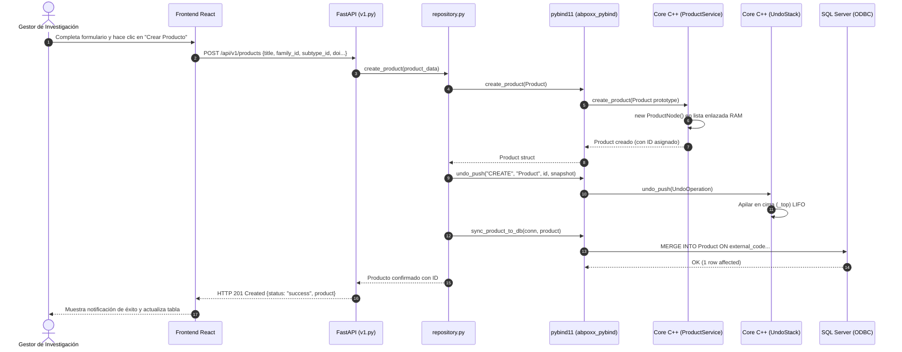

#### Secuencia 2: Ingesta desde URL Scienti GrupLAC con Deduplicación
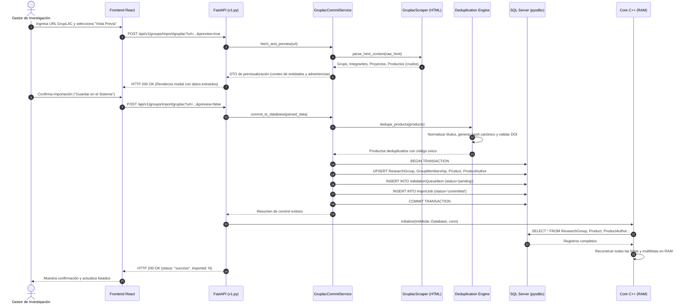

#### Secuencia 3: Vinculación de Integrante con Reglas RV-001 y RV-002
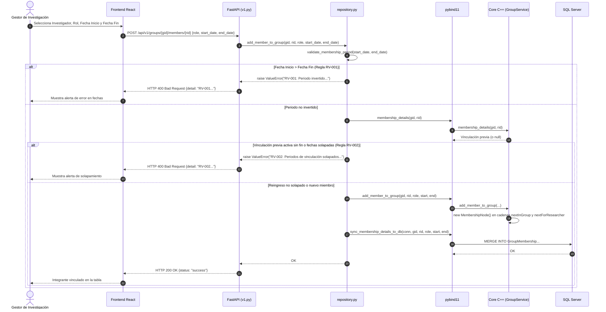

#### Secuencia 4: Validación Técnica de Evidencias en Cola FIFO
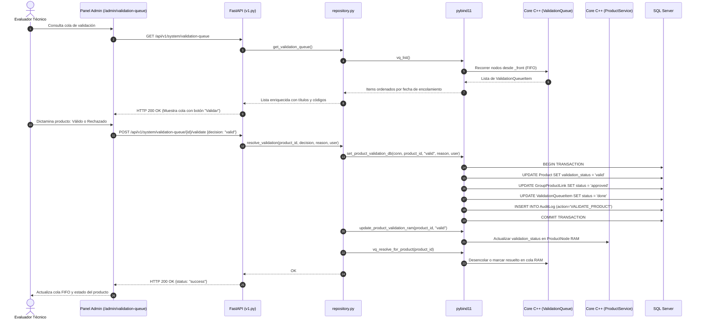

#### Secuencia 5: Deshacer Operación en Pila LIFO (Undo)
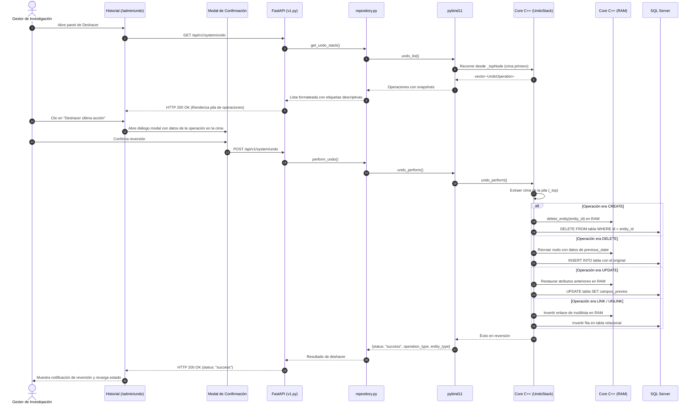

---

### 38.5 Diagrama de despliegue y arquitectura física

El siguiente diagrama ilustra la distribución de componentes físicos, procesos en ejecución y canales de comunicación en tiempo de ejecución:

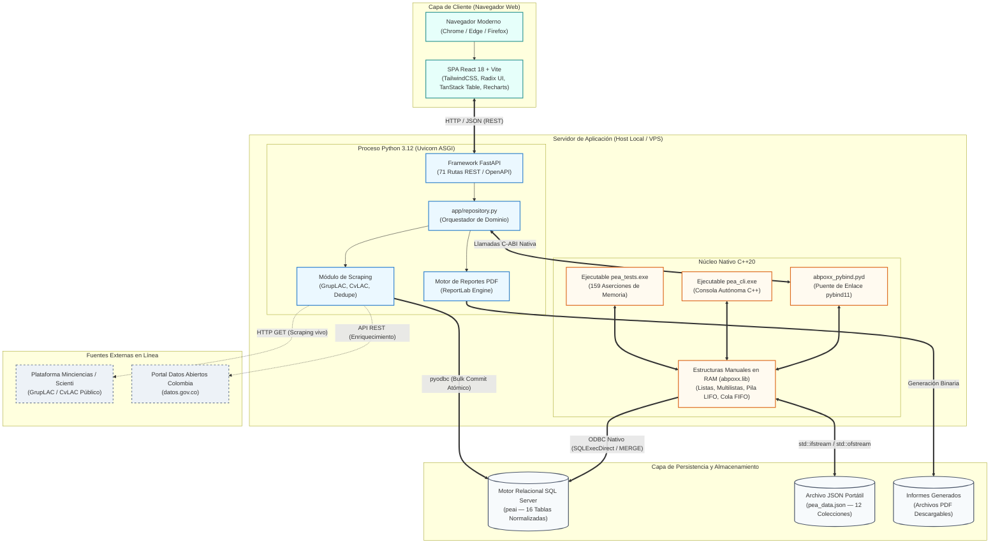

---

### 38.6 Diagrama del Hipercubo de información multidimensional

El siguiente diagrama formaliza el modelo de hipercubo recomendado en las especificaciones del Taller 2 ($\mathcal{H} = D_1 \times D_2 \times D_3 \times D_4 \to \mathcal{M}$), las dimensiones de enriquecimiento del catálogo Minciencias 2024, el vector de medidas analíticas y las cinco operaciones OLAP soportadas en la plataforma:

```mermaid
graph TB
    classDef dimStyle fill:#2b6cb0,stroke:#2c5282,stroke-width:2px,color:#fff;
    classDef extDimStyle fill:#ebf8ff,stroke:#3182ce,stroke-width:1.5px,color:#1a365d;
    classDef cubeStyle fill:#fefcbf,stroke:#d69e2e,stroke-width:2px,color:#744210;
    classDef opStyle fill:#e6fffa,stroke:#319795,stroke-width:1.5px,color:#234e52;
    classDef measStyle fill:#fed7d7,stroke:#e53e3e,stroke-width:1.5px,color:#742a2a;

    subgraph DimensionesPrimarias ["Espacio 4D Canónico: H = D1 × D2 × D3 × D4"]
        D1["D1: Grupo de Investigación\n(AITICE, GIE, etc.)"]:::dimStyle
        D2["D2: Investigador / Autor\n(Adith Pérez, etc.)"]:::dimStyle
        D3["D3: Producto de Investigación\n(Artículos, Software, etc.)"]:::dimStyle
        D4["D4: Tiempo / Ventana de Observación\n(Años 2020..2026, 2 y 5 años)"]:::dimStyle
    end

    subgraph DimensionesSecundarias ["Dimensiones de Enriquecimiento Minciencias 2024"]
        D5["D5: Familia Minciencias\n(GNC, DTI, ASC, DPC, FRH)"]:::extDimStyle
        D6["D6: Subtipo Canónico\n(70 Tipologías Oficiales)"]:::extDimStyle
        D7["D7: Calidad y Peso\n(A1, A, B, C, Top, Puntos)"]:::extDimStyle
        D8["D8: Estado Validación\n(Pendiente, Válido, Rechazado)"]:::extDimStyle
    end

    subgraph CeldaHipercubo ["Celda Multidimensional (Coordenada H)"]
        Cell["Celda Analítica H(g, i, p, t, fam, sub, q, val)\nVector de Medidas M:"]:::cubeStyle
        M1["M1: Conteo de Productos (N)"]:::measStyle
        M2["M2: Productos Validados vs Pendientes"]:::measStyle
        M3["M3: Puntaje Ponderado Minciencias"]:::measStyle
        M4["M4: Duración de Vinculación y Coautorías"]:::measStyle

        Cell --> M1
        Cell --> M2
        Cell --> M3
        Cell --> M4
    end

    subgraph OperacionesOLAP ["Operaciones Analíticas del Hipercubo en PEA-i"]
        OpSlice["SLICE (Corte Plano)\nFijar 1 dimensión\nEj: Productos sólo del año 2025"]:::opStyle
        OpDice["DICE (Subcubo)\nFiltrar múltiples rangos\nEj: GNC A1 en ventana 5 años de AITICE"]:::opStyle
        OpDrill["DRILL-DOWN (Desglose)\nFamilia GNC ➔ Subtipo ART ➔ Artículo Q1"]:::opStyle
        OpRoll["ROLL-UP (Agregación)\nProducto ➔ Subtipo ➔ Familia ➔ UPC Total"]:::opStyle
        OpPivot["PIVOT (Rotación)\nFilas: Grupos UPC ✕ Columnas: Años"]:::opStyle
    end

    D1 --> Cell
    D2 --> Cell
    D3 --> Cell
    D4 --> Cell
    D5 -.-> Cell
    D6 -.-> Cell
    D7 -.-> Cell
    D8 -.-> Cell

    Cell --> OpSlice
    Cell --> OpDice
    Cell --> OpDrill
    Cell --> OpRoll
    Cell --> OpPivot
```

---

## 39. Historias de usuario mínimas

### HU-01 Gestionar grupo

```text
Como gestor de investigación
quiero crear y editar grupos
para mantener actualizada la información institucional.
```

Criterios:

- El nombre es obligatorio.
- El código externo no se duplica.
- La desactivación conserva el historial.

### HU-02 Vincular investigador

```text
Como líder de grupo
quiero proponer la vinculación de un investigador por un periodo
para representar correctamente la composición del grupo.
```

Criterios:

- Las fechas son válidas.
- No se solapan periodos.
- La propuesta conserva solicitante y autorización.

### HU-03 Registrar producto

```text
Como investigador
quiero registrar un producto y sus autores
para incorporarlo al análisis de producción.
```

Criterios:

- Tiene familia, subtipo, título y fecha de obtención.
- Tiene al menos un autor.
- Se detectan duplicados básicos.

### HU-04 Asociar producto a grupo

```text
Como líder de grupo
quiero solicitar la asociación de un producto
para incluirlo en la producción del grupo cuando cumpla las reglas.
```

Criterios:

- Existe un autor vinculado en la fecha de obtención.
- La asociación conserva estado y autorización.
- No se contabiliza dos veces en el mismo grupo.

### HU-05 Importar información

```text
Como gestor de investigación
quiero importar la producción y miembros de grupos mediante la URL oficial de Scienti (GrupLAC / CvLAC) o archivo JSON pea_data.json
para reducir el registro manual y conciliar duplicados con precisión.
```

Criterios:

- Se extraen y concilian datos directamente de la URL viva de Scienti (Decisión D-03).
- Se conserva el dato original y se genera huella digital / hash estable determinista.
- Se muestra vista previa interactiva antes de confirmar el commit.
- Los errores bloqueantes impiden la confirmación.

### HU-06 Validar producto

```text
Como validador
quiero procesar productos en orden FIFO
para registrar decisiones trazables.
```

Criterios:

- El rechazo requiere motivo.
- Toda decisión registra fecha y responsable.

### HU-07 Consultar ventana

```text
Como usuario de consulta
quiero filtrar producción por una ventana de años
para analizar periodos comparables.
```

Criterios:

- El reporte muestra la ventana aplicada.
- Se utiliza la fecha de obtención.

### HU-08 Iniciar con o sin datos

```text
Como usuario de la demostración
quiero cargar un archivo o iniciar sin datos
para probar distintos escenarios.
```

## 40. Matriz de trazabilidad

| Requisito | Regla/Entidad | Endpoint / Comando Real | Prueba | Evidencia |
|---|---|---|---|---|
| Gestionar grupos | `ResearchGroup` | `GET/POST /api/v1/groups`, `pea_cli groups` | IT-GRP-001 | Captura UI + JSON 200 |
| Gestionar investigadores | `Researcher` | `GET/POST /api/v1/researchers`, `pea_cli researchers` | IT-RES-001 | Captura UI + JSON 200 |
| Gestionar productos | `Product` | `GET/POST /api/v1/products`, `pea_cli products` | IT-PRD-001 | Captura UI + 20 atributos 2024 |
| Gestionar planes | `WorkPlan` | `/groups/{id}/plans`, `plans/{id}`, `pea_cli plans` | UT-PLN-001 | Pestaña "Planes" + tests unitarios |
| Gestionar proyectos | `Project` | `/api/v1/projects`, `groups/{id}/projects`, `pea_cli projects` | UT-PRJ-001 | Pestaña "Proyectos" + tests unitarios |
| Vinculación temporal | `RV-001`, `RV-002` | `POST/PUT /api/v1/groups/{id}/members/{rid}` | UT-MEM-002 | `test_membership_rules.py` (HTTP 400 en solapado/invertido) |
| Producto-grupo | `RPG-001` | `POST /groups/{id}/products/{pid}`, `pea_cli products link` | UT-LNK-001 | Enlace multilista + deduplicación |
| Autores de producto | `ProductAuthor` | `GET/POST /api/v1/products/{id}/authors`, `pea_cli structures authors` | UT-AUT-001 | Orden, internos y externos persistidos |
| Lista enlazada | `LinkedList<T>` | `pea_cli structures groups|researchers|products` | UT-LST-001 | Recorrido de punteros en consola |
| Multilista | `ResearchMultilist` | `pea_cli structures multilist <gid>`, `/groups/{id}/memberships` | UT-MLT-001 | Punteros dobles ortogonales impresos |
| Pila LIFO (Deshacer) | `UndoOperation` | `POST /api/v1/system/undo`, `pea_cli history undo` | UT-STK-001 | Reversión simétrica y modal de confirmación |
| Cola FIFO (Validación) | `ValidationQueueItem` | `POST /api/v1/system/validation-queue/{id}/validate`, `pea_cli queue process` | UT-QUE-001 | Orden de llegada FIFO verificado |
| Ingesta URL Scienti | `ImportJob` | `/groups/import/gruplac`, `/researchers/import/cvlac`, `/groups/search/scienti` | IT-URL-001 | Vista previa + commit con deduplicación |
| Ingesta CSV / PDF | `ImportJob` | Excluido formalmente por Decisión D-03 | N/A | Sustituido por URL Scienti y `pea_data.json` |
| Ventana de observación | `ObservationWindow` | `GET /api/v1/products?start_year&end_year`, `/groups/{id}/report/pdf` | IT-WIN-001 | Filtro 2/5 años y selector en PDF |
| Persistencia dual | SQL / JSON | `POST /api/v1/system/initialize/*`, `GET /system/export` | IT-PER-001 | Reinicio exitoso y `pea_data.json` íntegro |
| Dashboard estadístico | Agregados C++ | `/admin` (KPIs), `/portal` (Recharts), `pea_cli summary` | E2E-DASH-001 | Histogramas, donuts y barras dinámicas |

## 41. Pruebas mínimas

### 41.1 C++ unitarias

- Insertar en lista vacía.
- Insertar al inicio y final.
- Buscar existente e inexistente.
- Modificar nodo.
- Desactivar nodo.
- Eliminar primero, intermedio y último.
- Recorrer hacia adelante y atrás.
- Crear enlaces de multilista.
- Recorrer grupo a integrantes.
- Recorrer investigador a grupos.
- Push, top y pop.
- Enqueue, front y dequeue.
- Mantener FIFO.
- Crear, editar y eliminar planes de un grupo (UT-PLN-001).
- Liberar la cadena de planes al eliminar el grupo (cascada).
- Deshacer creación, edición y borrado de planes (pila).
- Crear, consultar, editar y eliminar proyectos de la lista global (UT-PRJ-001).
- Enlazar y desenlazar proyectos de grupos; cascada al eliminar proyecto o grupo.
- Deshacer creación, edición, borrado, enlace y desenlace de proyectos (pila).
- Lectura y actualización de detalles de membresías, y deshacer UPDATE_MEMBERSHIP (UT-MEM-002).

### 41.2 Reglas de dominio

- Rechazar periodo invertido.
- Rechazar periodos solapados.
- Aceptar reingreso no solapado.
- Rechazar producto sin autor.
- Rechazar asociación sin vínculo temporal.
- Aceptar asociación con vínculo válido.
- Invalidar validación después de cambio crítico.

### 41.3 Persistencia

- Guardar y recuperar grupos.
- Reconstruir estructuras al reiniciar.
- Exportar JSON.
- Importar JSON.
- Iniciar vacío.
- Evitar doble importación del mismo archivo.

### 41.4 API

- Códigos HTTP correctos.
- Validación de DTO.
- Paginación.
- Filtros.
- Mapeo de excepciones C++.
- Carga de archivos.

### 41.5 Analítica

- Filtro por año.
- Ventana de dos años.
- Ventana de cinco años.
- Ventana personalizada (rango arbitrario desde–hasta y "últimos N años").
- Conteos por familia.
- Histograma.
- Barras.
- Vistas por grupo, investigador y producto.

## 42. Alcance obligatorio, complementario y excluido

### 42.1 Obligatorio

```text
Grupos
Investigadores
Productos
Integrantes
Planes
Categoría y validación
Listas
Multilistas
Pilas
Colas
CRUD
Persistencia
Carga por URL (D-03: GrupLAC, CvLAC, Scienti)
PDF y CSV (descartados, D-03)
Filtro por año
Resumen C++
Dashboard integrado (D-02)
Tres vistas
Archivo de persistencia
Carga o inicio vacío
Documentación
Video
Archivos de entrega
```

### 42.2 Complementario prioritario

```text
Git y GitHub
SQL Server
React
pybind11
Pruebas automatizadas
Auditoría
Docker si es estable
```

### 42.3 Segunda fase

```text
Motor genérico de reglas
Clasificación simulada avanzada
Todos los subtipos oficiales
Duplicados probabilísticos
Múltiples fuentes de scraping
Prioridad avanzada de cola
Undo de lotes completos
```

### 42.4 Excluido

```text
Rust
Segunda API
Aplicación móvil
Microservicios adicionales
Replicar CvLAC completo
Reconocimiento oficial automático
Scraping universal
OLAP empresarial real
```

## 43. Estructura final del repositorio

```text
pea-i/
├── README.md
├── INTEGRANTES.txt                  (pendiente de entrega)
├── pea_data.json                    (archivo de persistencia, entregable)
├── core_cpp/                        (solución C/C++ — D-01)
│   ├── include/
│   │   ├── entities/
│   │   ├── services/
│   │   └── persistence/
│   ├── src/
│   │   ├── services/
│   │   ├── persistence/
│   │   └── pea_cli.cpp              (CLI ejecutable: pea_cli.exe)
│   ├── pybind/
│   │   └── bindings.cpp             (puente de interoperabilidad)
│   └── CMakeLists.txt
├── backend/                         (solución Python — D-01)
│   ├── app/
│   │   ├── api/                     (router v1)
│   │   ├── scraper.py               (GrupLAC + buscador Scienti)
│   │   ├── cvlac_scraper.py         (CvLAC)
│   │   ├── datos_abiertos.py        (enriquecimiento datos.gov.co)
│   │   ├── repository.py            (orquestación RAM + núcleo C++)
│   │   └── main.py
│   ├── tests/
│   └── requirements.txt
├── frontend/
│   └── web-react/                   (dashboard y vistas — D-02)
├── database/
│   └── init_schema.sql
└── docs/
    ├── PEA-i_Especificacion_Integral_Cumplimiento_Taller2.md
    ├── Taller 2 EdD (2026-09-24) - G 5.md
    └── diagrams/                    (11 diagramas Mermaid, PNG alta resolución, SVG y visor web)

Pendientes de crear para la entrega:
├── docs/word/                       (especificación técnica .docx)
└── docs/video-script/               (guion del video de 10 minutos)
```

## 44. Lista de comprobación final

### Código

- [x] Núcleo C++ compila y `pea_cli.exe` ejecuta (solución C/C++, D-01).
- [x] Backend Python (FastAPI) ejecuta (solución Python, D-01).
- [x] Lista implementada manualmente.
- [x] Multilista implementada manualmente.
- [x] Pila funcional.
- [x] Cola FIFO funcional.
- [x] CRUD completo (incluye planes de trabajo y proyectos, T-08 y Req. 3).
- [x] pybind11 funcional.
- [x] FastAPI funcional.
- [x] React funcional.

### Datos

- [x] SQL Server creado.
- [x] Migraciones incluidas.
- [x] `pea_data.json` incluido.
- [x] Carga desde archivo probada.
- [x] Inicio sin datos probado.
- [x] Reconstrucción desde SQL probada.

### Importación

- [x] URL probada (GrupLAC y CvLAC contra SCIENTI real).
- [x] CSV probado — no aplica (D-03).
- [x] PDF probado — no aplica (D-03).
- [x] Vista previa.
- [x] Errores por fila.
- [x] Confirmación idempotente.

### Analítica

- [x] Filtro de dos años.
- [x] Filtro de cinco años.
- [x] Periodo personalizado — rango desde–hasta en el listado de productos y en el informe PDF del grupo (con selector de ventana y "últimos N años"), además de los presets 2/3/5/10 y del CLI `products by-year`.
- [x] Vista por grupo.
- [x] Vista por investigador.
- [x] Vista por producto.
- [x] Histograma y barras en el dashboard React (D-02).
- [x] Resumen C++.

### Documentación

- [ ] Word final.
- [x] Arquitectura (diagrama y descripción detallada en §38.5).
- [x] Modelo relacional (diagrama ER de 16 tablas en §38.2).
- [x] Hipercubo (diagrama y operaciones OLAP en §4, §29 y §38.6).
- [x] Entradas y salidas (catálogo de variables en §5 y §31).
- [x] Casos de uso (diagrama de 5 actores y 6 subsistemas en §38.1).
- [x] Historias de usuario (HU-01 a HU-08 con criterios de aceptación en §39).
- [x] Diagrama de clases (POO en C++ y servicios en §38.3).
- [x] Esquema gráfico de multilista en RAM (punteros ortogonales en §38.3.1).
- [x] Diagramas de secuencia (5 diagramas UML en §38.4).
- [x] Diccionario de datos (especificación de entidades y atributos en §17 y §38.2).
- [x] Matriz de trazabilidad (requisitos T-01 a T-43 en §3 y §28).
- [ ] Manual de instalación.
- [ ] Manual de usuario.

### Entrega

- [ ] `INTEGRANTES.txt`.
- [ ] Archivos con iniciales correctas — sustituido por entrega modular (D-01).
- [ ] Video aproximado de 10 minutos.
- [ ] Identidad institucional en video.
- [ ] Integrantes visibles en video.
- [ ] Repositorio o paquete final.
- [ ] Asunto de correo correcto.
- [ ] Destinatario correcto.
- [ ] Fecha límite verificada.

## 45. Veredicto de cobertura

Con las ampliaciones de esta versión, el diseño documental cubre explícitamente:

- Todos los requisitos funcionales identificados en el taller.
- Las cuatro estructuras exigidas.
- Las operaciones CRUD y persistencia por estructura.
- El modelo de hipercubo recomendado.
- Las variables de entrada y salida.
- Las dos soluciones, integradas en una sola aplicación (D-01).
- La aplicación integrada.
- La persistencia en SQL Server y archivo.
- La elección de cargar datos o iniciar vacío.
- Los entregables de documentación, video e identificación.
- Los complementos de Git, base de datos, GUI e interoperabilidad.

Alcance ajustado por las decisiones del equipo (sección 26.1): D-01 entrega ambas soluciones integradas en una sola aplicación, D-02 traslada el dashboard estadístico a la aplicación integrada y D-03 concentra la ingesta en la ruta URL oficial de SCIENTI, descartando PDF y CSV como alternativas equivalentes no implementadas. Ninguna de estas decisiones elimina un requisito obligatorio: reinterpretan su forma de entrega, y el equipo las expondrá y defenderá en el video.

La afirmación de cumplimiento total dependerá de completar la implementación y reunir las evidencias enumeradas en la matriz de trazabilidad y en la lista de comprobación.

> **Estado de implementación y verificación integral (2026-10-04):** T-08 (gestión de planes) está implementado de punta a punta: `PlanNode` en la multilista C++, `work_plan_service`, persistencia JSON y SQL Server (MERGE por id estable), pybind11, endpoints REST (`/groups/{id}/plans`, `/plans/{id}`), pestaña "Planes" en el detalle de grupo en React, comandos `plans` en `pea_cli` y pruebas unitarias. El CRUD independiente de proyectos (Requerimiento 3) está completo de punta a punta: `ProjectNode` en la lista global C++, `project_service`, persistencia JSON y SQL Server (MERGE por id estable), pybind11, endpoints REST (`/api/v1/projects` con paginación/búsqueda/estado, `/groups/{id}/projects`), página "Proyectos" en React, comandos `projects` en `pea_cli` y pruebas unitarias. El periodo de observación personalizado (T-26 / HU-07) está cubierto en toda la pila: rango arbitrario `start_year`–`end_year` y "últimos N años" (`window_years`) en `/products`, CLI `products by-year`, e informe PDF de grupo con selector de ventana en la UI que muestra la ventana aplicada y filtra la producción por año de obtención. T-07 (Membresías con rol/fechas) y las reglas de vinculación temporal (RV-001 de periodo invertido y RV-002 de periodos solapados/reingreso) están completamente implementadas en C++, RAM, persistencia (JSON/SQL), API (HTTP 400 en infracción) y deshacer bidireccional. La multilista de autores `ProductAuthorNode` y la exportación íntegra de los 20 atributos de producto del modelo Minciencias 2024 están operativas y sincronizadas en `pea_data.json`. La suite de pruebas de estructuras en C++ (`pea_tests.exe`) cuenta con 159/159 aserciones en verde (0 fallos). El backend en Python cuenta con 11 suites de pruebas automatizadas con 84 tests en verde (100% aprobadas) que cubren reglas de membresía, lógica y simetría de deshacer, enriquecimiento y filtros de cola, contratos 2024, scrapers e importadores. Todas las brechas documentales y funcionales detectadas en la auditoría han sido subsanadas.
